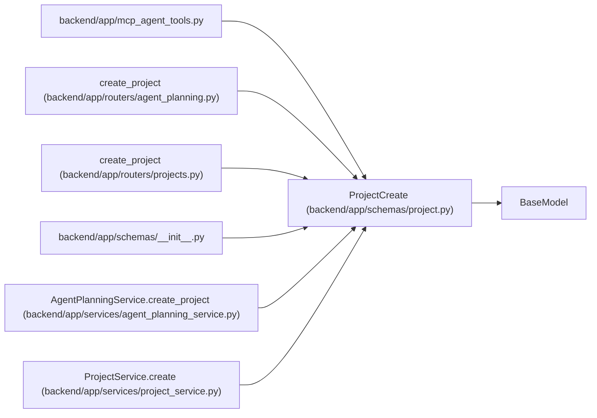

# ProjectCreate

**Location:** `backend/app/schemas/project.py:111`
**Kind:** Pydantic model
**Bases:** `BaseModel`
**Module:** [schemas_project](../modules/schemas_project.md)

## Description

Schema for creating a project.

## Attributes

| Name | Type | Wire name | Required | Nullable | Default | Constraints | Examples | Description |
|------|------|-----------|----------|----------|---------|-------------|-------------|----------|
| `name` | `str` | `name` | Yes | No | — | min_length=1; max_length=255 | — | — |
| `description` | `Optional[str]` | `description` | No | Yes | `None` | — | — | — |
| `status` | `ProjectStatus` | `status` | No | No | `ProjectStatus.PLANNED` | — | — | — |
| `health` | `ProjectHealth` | `health` | No | No | `ProjectHealth.UNKNOWN` | — | — | — |
| `owner_id` | `Optional[int]` | `owner_id` | No | Yes | `None` | — | — | — |
| `owner_profile_id` | `Optional[int]` | `owner_profile_id` | No | Yes | `None` | — | — | — |
| `initiative_id` | `Optional[int]` | `initiative_id` | No | Yes | `None` | — | — | — |
| `start_date` | `Optional[date]` | `start_date` | No | Yes | `None` | — | — | — |
| `target_date` | `Optional[date]` | `target_date` | No | Yes | `None` | — | — | — |
| `sort_order` | `int` | `sort_order` | No | No | `0` | — | — | — |

## Methods

*No public methods. Inherits from base classes.*

## Relationships

<!-- Auto-generated relationship summary. Do not edit by hand. -->

### Summary

| Module | Methods | Attributes |
|---|---:|---|
| [schemas_project](../modules/schemas_project.md) | 0 | `description`, `health`, `initiative_id`, `name`, `owner_id`, `owner_profile_id`, `sort_order`, `start_date`, `status`, `target_date` |

### Structure

| Kind | Entity | Module |
|---|---|---|
| Base | `BaseModel` | — |

### References

| Reference | Kind | Source | Call sites |
|---|---|---|---:|
| `mcp_agent_tools` | import | [mcp_agent_tools](../modules/mcp_agent_tools.md) | — |
| `create_project` | type_reference | [routers_agent_planning](../modules/routers_agent_planning.md) | — |
| `create_project` | type_reference | [projects](../modules/projects.md) | — |
| `__init__` | import | [schemas___init__](../modules/schemas___init__.md) | — |
| `AgentPlanningService.create_project` | type_reference | [agent_planning_service](../modules/agent_planning_service.md) | — |
| `ProjectService.create` | type_reference | [project_service](../modules/project_service.md) | — |
