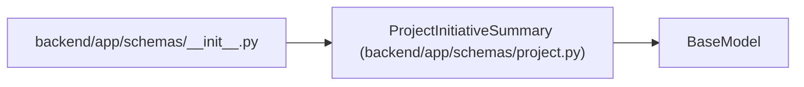

# ProjectInitiativeSummary

**Location:** `backend/app/schemas/project.py:97`
**Kind:** Pydantic model
**Bases:** `BaseModel`
**Module:** [schemas_project](../modules/schemas_project.md)

## Description

Compact initiative identity embedded in project responses.

## Model Configuration

| Setting | Value | Source |
|---------|-------|--------|
| `from_attributes` | `True` | model_config |

## Attributes

| Name | Type | Wire name | Required | Nullable | Default | Constraints | Examples | Description |
|------|------|-----------|----------|----------|---------|-------------|-------------|----------|
| `id` | `int` | `id` | Yes | No | — | — | — | — |
| `name` | `str` | `name` | Yes | No | — | — | — | — |
| `owner_id` | `Optional[int]` | `owner_id` | No | Yes | `None` | — | — | — |
| `owner` | `Optional[TeamMemberOptionResponse]` | `owner` | No | Yes | `None` | — | — | — |
| `owner_profile_id` | `Optional[int]` | `owner_profile_id` | No | Yes | `None` | — | — | — |
| `owner_profile` | `Optional[TeamMemberProfileCompact]` | `owner_profile` | No | Yes | `None` | — | — | — |
| `health` | `str` | `health` | Yes | No | — | — | — | — |
| `target_date` | `Optional[date]` | `target_date` | No | Yes | `None` | — | — | — |

## Methods

*No public methods. Inherits from base classes.*

## Relationships

<!-- Auto-generated relationship summary. Do not edit by hand. -->

### Summary

| Module | Methods | Attributes |
|---|---:|---|
| [schemas_project](../modules/schemas_project.md) | 0 | `health`, `id`, `name`, `owner`, `owner_id`, `owner_profile`, `owner_profile_id`, `target_date` |

### Structure

| Kind | Entity | Module |
|---|---|---|
| Base | `BaseModel` | — |

### References

| Reference | Kind | Source | Call sites |
|---|---|---|---:|
| `__init__` | import | [schemas___init__](../modules/schemas___init__.md) | — |
