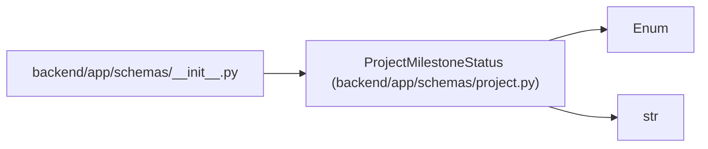

# ProjectMilestoneStatus

**Location:** `backend/app/schemas/project.py:45`
**Kind:** Enum
**Bases:** `str`, `Enum`
**Module:** [schemas_project](../modules/schemas_project.md)

## Description

Explicit lifecycle status for a project milestone.

## Attributes

| Name | Declared value | Description |
|------|-------|-------------|
| `PLANNED` | `'planned'` | — |
| `ACTIVE` | `'active'` | — |
| `COMPLETED` | `'completed'` | — |
| `CANCELED` | `'canceled'` | — |

## Methods

*No public methods. Inherits from base classes.*

## Relationships

<!-- Auto-generated relationship summary. Do not edit by hand. -->

### Summary

| Module | Methods | Attributes |
|---|---:|---|
| [schemas_project](../modules/schemas_project.md) | 0 | `ACTIVE`, `CANCELED`, `COMPLETED`, `PLANNED` |

### Structure

| Kind | Entity | Module |
|---|---|---|
| Base | `Enum` | — |
| Base | `str` | — |

### References

| Reference | Kind | Source | Call sites |
|---|---|---|---:|
| `__init__` | import | [schemas___init__](../modules/schemas___init__.md) | — |
