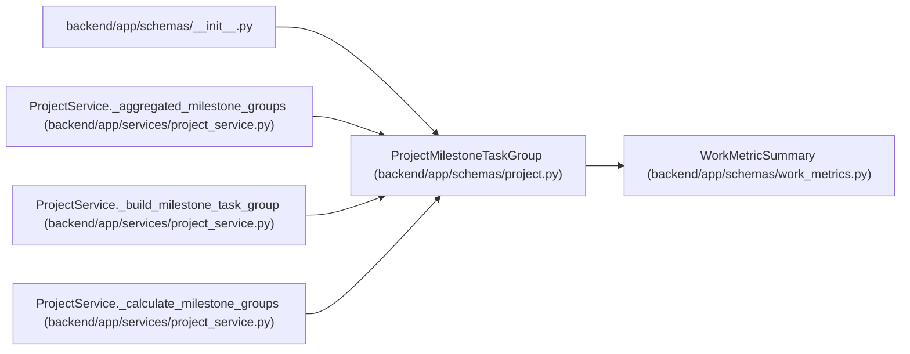

# ProjectMilestoneTaskGroup

**Location:** `backend/app/schemas/project.py:256`
**Kind:** Pydantic model
**Bases:** `WorkMetricSummary`
**Module:** [schemas_project](../modules/schemas_project.md)

## Description

Task progress metrics grouped under one milestone or unassigned work.

## Attributes

| Name | Type | Wire name | Required | Nullable | Default | Constraints | Examples | Description |
|------|------|-----------|----------|----------|---------|-------------|-------------|----------|
| `milestone_id` | `Optional[int]` | `milestone_id` | No | Yes | `None` | — | — | — |
| `milestone` | `Optional[ProjectMilestoneSummary]` | `milestone` | No | Yes | `None` | — | — | — |
| `name` | `str` | `name` | Yes | No | — | — | — | — |
| `task_count` | `int` | `task_count` | No | No | `0` | — | — | — |
| `completed_tasks` | `int` | `completed_tasks` | No | No | `0` | — | — | — |
| `completion_percent` | `float` | `completion_percent` | No | No | `0.0` | — | — | — |
| `status_counts` | `dict[str, int]` | `status_counts` | No | No | factory: `lambda: {'planned': 0, 'active': 0, 'resolved': 0, 'closed': 0}` | — | — | — |
| `total_effort_days` | `float` | `total_effort_days` | No | No | `0.0` | — | — | — |
| `remaining_effort_days` | `float` | `remaining_effort_days` | No | No | `0.0` | — | — | — |

## Methods

*No public methods. Inherits from base classes.*

## Relationships

<!-- Auto-generated relationship summary. Do not edit by hand. -->

### Summary

| Module | Methods | Attributes |
|---|---:|---|
| [schemas_project](../modules/schemas_project.md) | 0 | `completed_tasks`, `completion_percent`, `milestone`, `milestone_id`, `name`, `remaining_effort_days`, `status_counts`, `task_count`, `total_effort_days` |

### Structure

| Kind | Entity | Module |
|---|---|---|
| Base | `WorkMetricSummary` | [schemas_work_metrics](../modules/schemas_work_metrics.md) |

### References

| Reference | Kind | Source | Call sites |
|---|---|---|---:|
| `__init__` | import | [schemas___init__](../modules/schemas___init__.md) | — |
| `ProjectService._aggregated_milestone_groups` | call | [project_service](../modules/project_service.md) | 1 |
| `ProjectService._aggregated_milestone_groups` | type_reference | [project_service](../modules/project_service.md) | — |
| `ProjectService._build_milestone_task_group` | call | [project_service](../modules/project_service.md) | 1 |
| `ProjectService._build_milestone_task_group` | type_reference | [project_service](../modules/project_service.md) | — |
| `ProjectService._calculate_milestone_groups` | type_reference | [project_service](../modules/project_service.md) | — |
