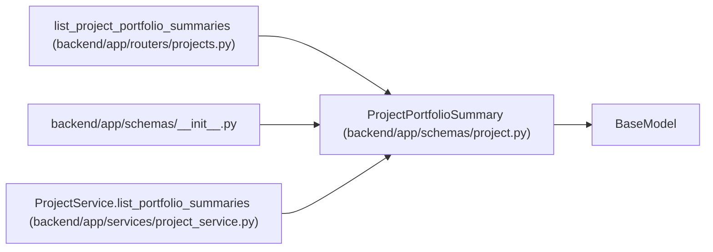

# ProjectPortfolioSummary

**Location:** `backend/app/schemas/project.py:292`
**Kind:** Pydantic model
**Bases:** `BaseModel`
**Module:** [schemas_project](../modules/schemas_project.md)

## Description

Compact project signals for portfolio tables.

## Attributes

| Name | Type | Wire name | Required | Nullable | Default | Constraints | Examples | Description |
|------|------|-----------|----------|----------|---------|-------------|-------------|----------|
| `project_id` | `int` | `project_id` | Yes | No | — | — | — | — |
| `total_tasks` | `int` | `total_tasks` | No | No | `0` | — | — | — |
| `completed_tasks` | `int` | `completed_tasks` | No | No | `0` | — | — | — |
| `total_effort_days` | `float` | `total_effort_days` | No | No | `0.0` | — | — | — |
| `remaining_effort_days` | `float` | `remaining_effort_days` | No | No | `0.0` | — | — | — |
| `blocked_tasks` | `int` | `blocked_tasks` | No | No | `0` | — | — | — |
| `overdue_tasks` | `int` | `overdue_tasks` | No | No | `0` | — | — | — |
| `target_date_risk` | `ProjectTargetDateRisk` | `target_date_risk` | No | No | `ProjectTargetDateRisk.UNKNOWN` | — | — | — |

## Methods

*No public methods. Inherits from base classes.*

## Relationships

<!-- Auto-generated relationship summary. Do not edit by hand. -->

### Summary

| Module | Methods | Attributes |
|---|---:|---|
| [schemas_project](../modules/schemas_project.md) | 0 | `blocked_tasks`, `completed_tasks`, `overdue_tasks`, `project_id`, `remaining_effort_days`, `target_date_risk`, `total_effort_days`, `total_tasks` |

### Structure

| Kind | Entity | Module |
|---|---|---|
| Base | `BaseModel` | — |

### References

| Reference | Kind | Source | Call sites |
|---|---|---|---:|
| `list_project_portfolio_summaries` | type_reference | [projects](../modules/projects.md) | — |
| `__init__` | import | [schemas___init__](../modules/schemas___init__.md) | — |
| `ProjectService.list_portfolio_summaries` | call | [project_service](../modules/project_service.md) | 1 |
| `ProjectService.list_portfolio_summaries` | type_reference | [project_service](../modules/project_service.md) | — |
