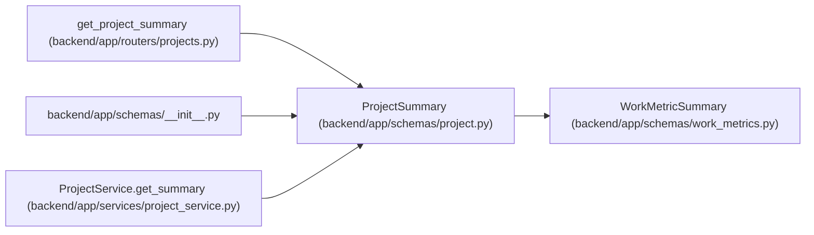

# ProjectSummary

**Location:** `backend/app/schemas/project.py:314`
**Kind:** Pydantic model
**Bases:** `WorkMetricSummary`
**Module:** [schemas_project](../modules/schemas_project.md)

## Description

Summary statistics for a project.

## Attributes

| Name | Type | Wire name | Required | Nullable | Default | Constraints | Examples | Description |
|------|------|-----------|----------|----------|---------|-------------|-------------|----------|
| `id` | `int` | `id` | Yes | No | — | — | — | — |
| `name` | `str` | `name` | Yes | No | — | — | — | — |
| `status` | `str` | `status` | Yes | No | — | — | — | — |
| `health` | `str` | `health` | Yes | No | — | — | — | — |
| `owner_id` | `Optional[int]` | `owner_id` | No | Yes | `None` | — | — | — |
| `owner` | `Optional[TeamMemberOptionResponse]` | `owner` | No | Yes | `None` | — | — | — |
| `owner_profile_id` | `Optional[int]` | `owner_profile_id` | No | Yes | `None` | — | — | — |
| `owner_profile` | `Optional[TeamMemberProfileCompact]` | `owner_profile` | No | Yes | `None` | — | — | — |
| `initiative_id` | `Optional[int]` | `initiative_id` | No | Yes | `None` | — | — | — |
| `start_date` | `Optional[date]` | `start_date` | No | Yes | `None` | — | — | — |
| `target_date` | `Optional[date]` | `target_date` | No | Yes | `None` | — | — | — |
| `completed_at` | `Optional[datetime]` | `completed_at` | No | Yes | `None` | — | — | — |
| `total_tasks` | `int` | `total_tasks` | No | No | `0` | — | — | — |
| `completed_tasks` | `int` | `completed_tasks` | No | No | `0` | — | — | — |
| `completion_percent` | `float` | `completion_percent` | No | No | `0.0` | — | — | — |
| `active_tasks` | `int` | `active_tasks` | No | No | `0` | — | — | — |
| `blocked_tasks` | `int` | `blocked_tasks` | No | No | `0` | — | — | — |
| `overdue_tasks` | `int` | `overdue_tasks` | No | No | `0` | — | — | — |
| `target_date_risk` | `ProjectTargetDateRisk` | `target_date_risk` | No | No | `ProjectTargetDateRisk.UNKNOWN` | — | — | — |
| `target_date_risk_reason` | `Optional[str]` | `target_date_risk_reason` | No | Yes | `None` | — | — | — |
| `target_date_slip_days` | `int` | `target_date_slip_days` | No | No | `0` | — | — | — |
| `days_until_target` | `Optional[int]` | `days_until_target` | No | Yes | `None` | — | — | — |
| `status_counts` | `dict[str, int]` | `status_counts` | No | No | factory: `lambda: {'planned': 0, 'active': 0, 'resolved': 0, 'closed': 0}` | — | — | — |
| `total_effort_days` | `float` | `total_effort_days` | No | No | `0.0` | — | — | — |
| `remaining_effort_days` | `float` | `remaining_effort_days` | No | No | `0.0` | — | — | — |
| `milestone_groups` | `list[ProjectMilestoneTaskGroup]` | `milestone_groups` | No | No | factory: `list` | — | — | — |
| `request_count` | `int` | `request_count` | No | No | `0` | — | — | — |
| `task_start_date` | `Optional[date]` | `task_start_date` | No | Yes | `None` | — | — | — |
| `task_end_date` | `Optional[date]` | `task_end_date` | No | Yes | `None` | — | — | — |
| `latest_update` | `Optional[ProjectUpdateEntryResponse]` | `latest_update` | No | Yes | `None` | — | — | — |
| `latest_update_at` | `Optional[datetime]` | `latest_update_at` | No | Yes | `None` | — | — | — |
| `days_since_latest_update` | `Optional[int]` | `days_since_latest_update` | No | Yes | `None` | — | — | — |
| `update_freshness` | `ProjectUpdateFreshness` | `update_freshness` | No | No | `ProjectUpdateFreshness.MISSING` | — | — | — |
| `is_update_stale` | `bool` | `is_update_stale` | No | No | `True` | — | — | — |
| `stale_update_threshold_days` | `int` | `stale_update_threshold_days` | No | No | `STALE_PROJECT_UPDATE_DAYS` | — | — | — |

## Methods

*No public methods. Inherits from base classes.*

## Relationships

<!-- Auto-generated relationship summary. Do not edit by hand. -->

### Summary

| Module | Methods | Attributes |
|---|---:|---|
| [schemas_project](../modules/schemas_project.md) | 0 | `active_tasks`, `blocked_tasks`, `completed_at`, `completed_tasks`, `completion_percent`, `days_since_latest_update`, `days_until_target`, `health`, `id`, `initiative_id`, `is_update_stale`, `latest_update` |

### Structure

| Kind | Entity | Module |
|---|---|---|
| Base | `WorkMetricSummary` | [schemas_work_metrics](../modules/schemas_work_metrics.md) |

### References

| Reference | Kind | Source | Call sites |
|---|---|---|---:|
| `get_project_summary` | type_reference | [projects](../modules/projects.md) | — |
| `__init__` | import | [schemas___init__](../modules/schemas___init__.md) | — |
| `ProjectService.get_summary` | call | [project_service](../modules/project_service.md) | 1 |
| `ProjectService.get_summary` | type_reference | [project_service](../modules/project_service.md) | — |
