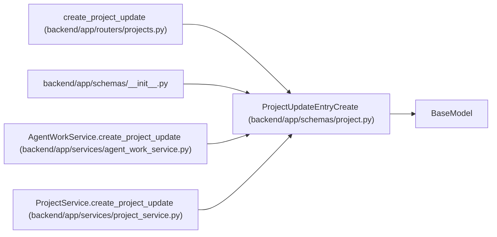

# ProjectUpdateEntryCreate

**Location:** `backend/app/schemas/project.py:148`
**Kind:** Pydantic model
**Bases:** `BaseModel`
**Module:** [schemas_project](../modules/schemas_project.md)

## Description

Schema for creating an append-only project update.

## Model Configuration

| Setting | Value | Source |
|---------|-------|--------|
| `extra` | `'forbid'` | model_config |

## Attributes

| Name | Type | Wire name | Required | Nullable | Default | Constraints | Examples | Description |
|------|------|-----------|----------|----------|---------|-------------|-------------|----------|
| `health` | `ProjectHealth` | `health` | Yes | No | — | — | — | — |
| `summary` | `str` | `summary` | Yes | No | — | min_length=1 | — | — |
| `progress_text` | `Optional[str]` | `progress_text` | No | Yes | `None` | — | — | — |
| `risks_text` | `Optional[str]` | `risks_text` | No | Yes | `None` | — | — | — |
| `decisions_text` | `Optional[str]` | `decisions_text` | No | Yes | `None` | — | — | — |
| `next_steps_text` | `Optional[str]` | `next_steps_text` | No | Yes | `None` | — | — | — |

## Methods

*No public methods. Inherits from base classes.*

## Relationships

<!-- Auto-generated relationship summary. Do not edit by hand. -->

### Summary

| Module | Methods | Attributes |
|---|---:|---|
| [schemas_project](../modules/schemas_project.md) | 0 | `decisions_text`, `health`, `next_steps_text`, `progress_text`, `risks_text`, `summary` |

### Structure

| Kind | Entity | Module |
|---|---|---|
| Base | `BaseModel` | — |

### References

| Reference | Kind | Source | Call sites |
|---|---|---|---:|
| `create_project_update` | type_reference | [projects](../modules/projects.md) | — |
| `__init__` | import | [schemas___init__](../modules/schemas___init__.md) | — |
| `AgentWorkService.create_project_update` | call | [agent_work_service](../modules/agent_work_service.md) | 1 |
| `ProjectService.create_project_update` | type_reference | [project_service](../modules/project_service.md) | — |
