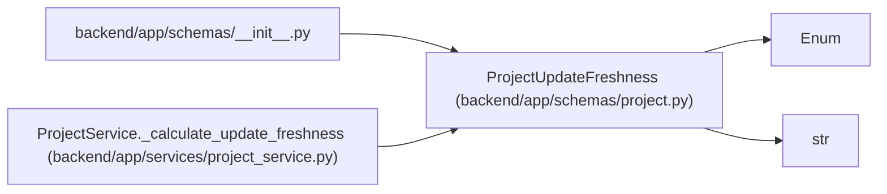

# ProjectUpdateFreshness

**Location:** `backend/app/schemas/project.py:41`
**Kind:** Enum
**Bases:** `str`, `Enum`
**Module:** [schemas_project](../modules/schemas_project.md)

## Description

Freshness state for project stakeholder updates.

## Attributes

| Name | Declared value | Description |
|------|-------|-------------|
| `FRESH` | `'fresh'` | — |
| `STALE` | `'stale'` | — |
| `MISSING` | `'missing'` | — |
| `NOT_REQUIRED` | `'not_required'` | — |

## Methods

*No public methods. Inherits from base classes.*

## Relationships

<!-- Auto-generated relationship summary. Do not edit by hand. -->

### Summary

| Module | Methods | Attributes |
|---|---:|---|
| [schemas_project](../modules/schemas_project.md) | 0 | `FRESH`, `MISSING`, `NOT_REQUIRED`, `STALE` |

### Structure

| Kind | Entity | Module |
|---|---|---|
| Base | `Enum` | — |
| Base | `str` | — |

### References

| Reference | Kind | Source | Call sites |
|---|---|---|---:|
| `__init__` | import | [schemas___init__](../modules/schemas___init__.md) | — |
| `ProjectService._calculate_update_freshness` | type_reference | [project_service](../modules/project_service.md) | — |
