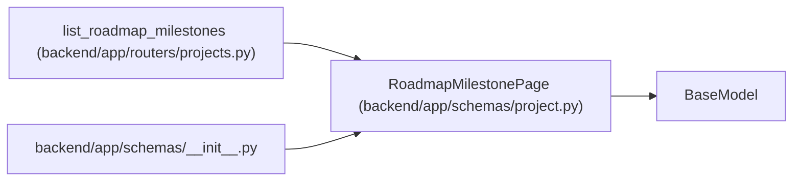

# RoadmapMilestonePage

**Location:** `backend/app/schemas/project.py:225`
**Kind:** Pydantic model
**Bases:** `BaseModel`
**Module:** [schemas_project](../modules/schemas_project.md)

## Description

Cursor page of milestones used by the portfolio roadmap.

## Attributes

| Name | Type | Wire name | Required | Nullable | Default | Constraints | Examples | Description |
|------|------|-----------|----------|----------|---------|-------------|-------------|----------|
| `items` | `list[ProjectMilestoneResponse]` | `items` | No | No | factory: `list` | — | — | — |
| `next_cursor` | `Optional[int]` | `next_cursor` | No | Yes | `None` | — | — | — |

## Methods

*No public methods. Inherits from base classes.*

## Relationships

<!-- Auto-generated relationship summary. Do not edit by hand. -->

### Summary

| Module | Methods | Attributes |
|---|---:|---|
| [schemas_project](../modules/schemas_project.md) | 0 | `items`, `next_cursor` |

### Structure

| Kind | Entity | Module |
|---|---|---|
| Base | `BaseModel` | — |

### References

| Reference | Kind | Source | Call sites |
|---|---|---|---:|
| `list_roadmap_milestones` | call | [projects](../modules/projects.md) | 1 |
| `list_roadmap_milestones` | type_reference | [projects](../modules/projects.md) | — |
| `__init__` | import | [schemas___init__](../modules/schemas___init__.md) | — |
