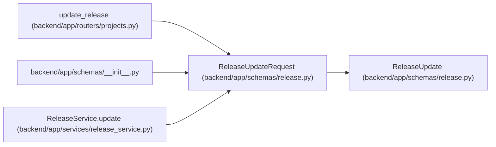

# ReleaseUpdateRequest

**Location:** `backend/app/schemas/release.py:77`
**Kind:** Pydantic model
**Bases:** `ReleaseUpdate`
**Module:** [schemas_release](../modules/schemas_release.md)

## Description

API request for partially updating a release.

## Attributes

*No annotated attributes found.*

## Methods

*No public methods. Inherits from base classes.*

## Relationships

<!-- Auto-generated relationship summary. Do not edit by hand. -->

### Summary

| Module | Methods | Attributes |
|---|---:|---|
| [schemas_release](../modules/schemas_release.md) | 0 | — |

### Structure

| Kind | Entity | Module |
|---|---|---|
| Base | `ReleaseUpdate` | [schemas_release](../modules/schemas_release.md) |

### References

| Reference | Kind | Source | Call sites |
|---|---|---|---:|
| `update_release` | type_reference | [projects](../modules/projects.md) | — |
| `__init__` | import | [schemas___init__](../modules/schemas___init__.md) | — |
| `ReleaseService.update` | type_reference | [release_service](../modules/release_service.md) | — |
