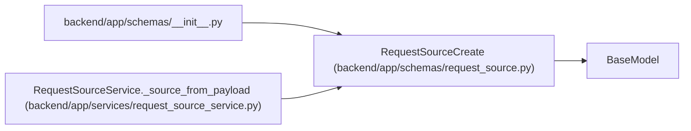

# RequestSourceCreate

**Location:** `backend/app/schemas/request_source.py:39`
**Kind:** Pydantic model
**Bases:** `BaseModel`
**Module:** [schemas_request_source](../modules/schemas_request_source.md)

## Description

Schema for creating a request source.

## Model Configuration

| Setting | Value | Source |
|---------|-------|--------|
| `extra` | `'forbid'` | model_config |

## Validators

| Method | Scope | Fields | Mode | Options |
|--------|-------|--------|------|---------|
| `validate_source_url` | field | source_url | after | — |

## Attributes

| Name | Type | Wire name | Required | Nullable | Default | Constraints | Examples | Description |
|------|------|-----------|----------|----------|---------|-------------|-------------|----------|
| `title` | `str` | `title` | Yes | No | — | max_length=500; min_length=1 | — | — |
| `description` | `Optional[str]` | `description` | No | Yes | `None` | — | — | — |
| `source_type` | `RequestSourceType` | `source_type` | Yes | No | — | — | — | — |
| `source_name` | `Optional[str]` | `source_name` | No | Yes | `None` | max_length=255 | — | — |
| `source_url` | `Optional[str]` | `source_url` | No | Yes | `None` | max_length=1000 | — | — |
| `external_key` | `Optional[str]` | `external_key` | No | Yes | `None` | max_length=255 | — | — |
| `priority_hint` | `Optional[int]` | `priority_hint` | No | Yes | `None` | ge=1; le=10 | — | — |

## Methods

| Method | Signature | Decorators | Description |
|--------|-----------|------------|-------------|
| `validate_source_url` | `(value: Optional[str]) -> Optional[str]` | `@field_validator('source_url')`, `@classmethod` | — |

## Relationships

<!-- Auto-generated relationship summary. Do not edit by hand. -->

### Summary

| Module | Methods | Attributes |
|---|---:|---|
| [schemas_request_source](../modules/schemas_request_source.md) | 1 | `description`, `external_key`, `priority_hint`, `source_name`, `source_type`, `source_url`, `title` |

### Structure

| Kind | Entity | Module |
|---|---|---|
| Base | `BaseModel` | — |

### References

| Reference | Kind | Source | Call sites |
|---|---|---|---:|
| `__init__` | import | [schemas___init__](../modules/schemas___init__.md) | — |
| `RequestSourceService._source_from_payload` | type_reference | [request_source_service](../modules/request_source_service.md) | — |
