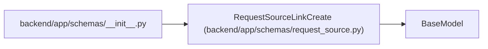

# RequestSourceLinkCreate

**Location:** `backend/app/schemas/request_source.py:93`
**Kind:** Pydantic model
**Bases:** `BaseModel`
**Module:** [schemas_request_source](../modules/schemas_request_source.md)

## Description

Schema for linking one request source to one target.

## Model Configuration

| Setting | Value | Source |
|---------|-------|--------|
| `extra` | `'forbid'` | model_config |

## Validators

| Method | Scope | Fields | Mode | Options |
|--------|-------|--------|------|---------|
| `validate_single_target` | model | — | after | — |

## Attributes

| Name | Type | Wire name | Required | Nullable | Default | Constraints | Examples | Description |
|------|------|-----------|----------|----------|---------|-------------|-------------|----------|
| `request_source_id` | `int` | `request_source_id` | Yes | No | — | — | — | — |
| `triage_item_id` | `Optional[int]` | `triage_item_id` | No | Yes | `None` | — | — | — |
| `task_id` | `Optional[int]` | `task_id` | No | Yes | `None` | — | — | — |
| `project_id` | `Optional[int]` | `project_id` | No | Yes | `None` | — | — | — |

## Methods

| Method | Signature | Decorators | Description |
|--------|-----------|------------|-------------|
| `validate_single_target` | `()` | `@model_validator(mode='after')` | Require exactly one target entity. |

## Relationships

<!-- Auto-generated relationship summary. Do not edit by hand. -->

### Summary

| Module | Methods | Attributes |
|---|---:|---|
| [schemas_request_source](../modules/schemas_request_source.md) | 1 | `project_id`, `request_source_id`, `task_id`, `triage_item_id` |

### Structure

| Kind | Entity | Module |
|---|---|---|
| Base | `BaseModel` | — |

### References

| Reference | Kind | Source | Call sites |
|---|---|---|---:|
| `__init__` | import | [schemas___init__](../modules/schemas___init__.md) | — |
