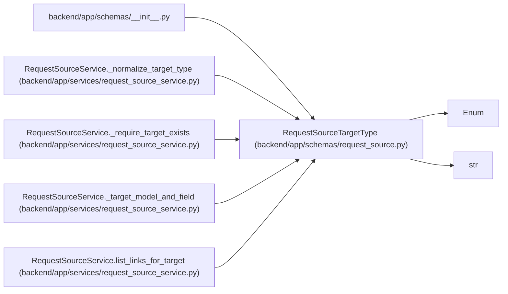

# RequestSourceTargetType

**Location:** `backend/app/schemas/request_source.py:31`
**Kind:** Enum
**Bases:** `str`, `Enum`
**Module:** [schemas_request_source](../modules/schemas_request_source.md)

## Description

Supported request-source link target types.

## Attributes

| Name | Declared value | Description |
|------|-------|-------------|
| `TASK` | `'task'` | — |
| `PROJECT` | `'project'` | — |
| `TRIAGE_ITEM` | `'triage_item'` | — |

## Methods

*No public methods. Inherits from base classes.*

## Relationships

<!-- Auto-generated relationship summary. Do not edit by hand. -->

### Summary

| Module | Methods | Attributes |
|---|---:|---|
| [schemas_request_source](../modules/schemas_request_source.md) | 0 | `PROJECT`, `TASK`, `TRIAGE_ITEM` |

### Structure

| Kind | Entity | Module |
|---|---|---|
| Base | `Enum` | — |
| Base | `str` | — |

### References

| Reference | Kind | Source | Call sites |
|---|---|---|---:|
| `__init__` | import | [schemas___init__](../modules/schemas___init__.md) | — |
| `RequestSourceService._normalize_target_type` | call | [request_source_service](../modules/request_source_service.md) | 1 |
| `RequestSourceService._normalize_target_type` | type_reference | [request_source_service](../modules/request_source_service.md) | — |
| `RequestSourceService._require_target_exists` | type_reference | [request_source_service](../modules/request_source_service.md) | — |
| `RequestSourceService._target_model_and_field` | type_reference | [request_source_service](../modules/request_source_service.md) | — |
| `RequestSourceService.list_links_for_target` | type_reference | [request_source_service](../modules/request_source_service.md) | — |
