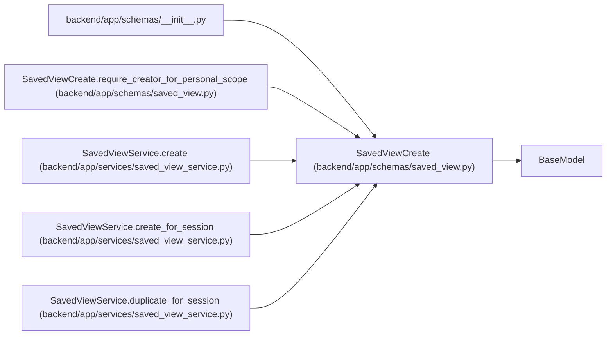

# SavedViewCreate

**Location:** `backend/app/schemas/saved_view.py:23`
**Kind:** Pydantic model
**Bases:** `BaseModel`
**Module:** [schemas_saved_view](../modules/schemas_saved_view.md)

## Description

Schema for creating a saved view.

## Model Configuration

| Setting | Value | Source |
|---------|-------|--------|
| `extra` | `'forbid'` | model_config |

## Validators

| Method | Scope | Fields | Mode | Options |
|--------|-------|--------|------|---------|
| `require_creator_for_personal_scope` | model | — | after | — |

## Attributes

| Name | Type | Wire name | Required | Nullable | Default | Constraints | Examples | Description |
|------|------|-----------|----------|----------|---------|-------------|-------------|----------|
| `name` | `str` | `name` | Yes | No | — | max_length=255; min_length=1 | — | — |
| `description` | `Optional[str]` | `description` | No | Yes | `None` | — | — | — |
| `view_type` | `SavedViewType` | `view_type` | Yes | No | — | — | — | — |
| `scope` | `SavedViewScope` | `scope` | No | No | `SavedViewScope.PERSONAL` | — | — | — |
| `filters_json` | `dict[str, Any]` | `filters_json` | No | No | factory: `dict` | — | — | — |
| `sort_json` | `dict[str, Any]` | `sort_json` | No | No | factory: `dict` | — | — | — |
| `columns_json` | `dict[str, Any]` | `columns_json` | No | No | factory: `dict` | — | — | — |
| `created_by_session_id` | `Optional[int]` | `created_by_session_id` | No | Yes | `None` | — | — | — |
| `schema_version` | `int` | `schema_version` | No | No | `1` | ge=1 | — | — |

## Methods

| Method | Signature | Decorators | Description |
|--------|-----------|------------|-------------|
| `require_creator_for_personal_scope` | `() -> 'SavedViewCreate'` | `@model_validator(mode='after')` | Personal views must be associated with a user session. |

## Relationships

<!-- Auto-generated relationship summary. Do not edit by hand. -->

### Summary

| Module | Methods | Attributes |
|---|---:|---|
| [schemas_saved_view](../modules/schemas_saved_view.md) | 1 | `columns_json`, `created_by_session_id`, `description`, `filters_json`, `name`, `schema_version`, `scope`, `sort_json`, `view_type` |

### Structure

| Kind | Entity | Module |
|---|---|---|
| Base | `BaseModel` | — |

### References

| Reference | Kind | Source | Call sites |
|---|---|---|---:|
| `__init__` | import | [schemas___init__](../modules/schemas___init__.md) | — |
| `SavedViewCreate.require_creator_for_personal_scope` | type_reference | [schemas_saved_view](../modules/schemas_saved_view.md) | — |
| `SavedViewService.create` | type_reference | [saved_view_service](../modules/saved_view_service.md) | — |
| `SavedViewService.create_for_session` | call | [saved_view_service](../modules/saved_view_service.md) | 1 |
| `SavedViewService.create_for_session` | type_reference | [saved_view_service](../modules/saved_view_service.md) | — |
| `SavedViewService.duplicate_for_session` | call | [saved_view_service](../modules/saved_view_service.md) | 1 |
