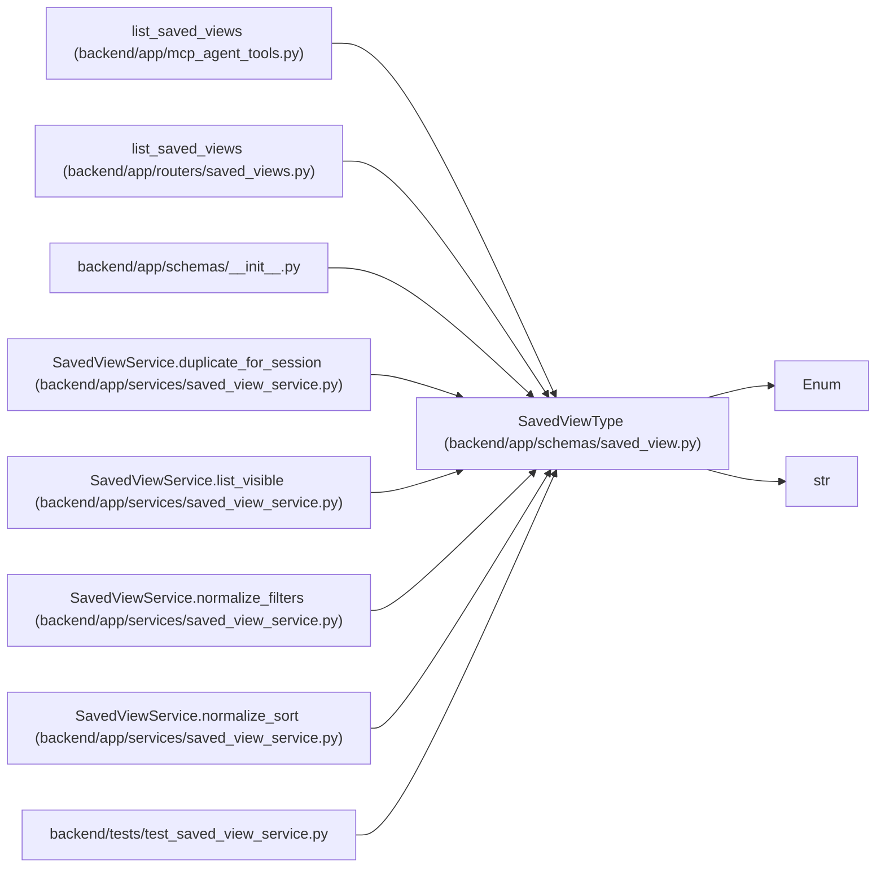

# SavedViewType

**Location:** `backend/app/schemas/saved_view.py:9`
**Kind:** Enum
**Bases:** `str`, `Enum`
**Module:** [schemas_saved_view](../modules/schemas_saved_view.md)

## Description

Surface that a saved view applies to.

## Attributes

| Name | Declared value | Description |
|------|-------|-------------|
| `TASKS` | `'tasks'` | — |
| `PROJECTS` | `'projects'` | — |
| `TRIAGE` | `'triage'` | — |

## Methods

*No public methods. Inherits from base classes.*

## Relationships

<!-- Auto-generated relationship summary. Do not edit by hand. -->

### Summary

| Module | Methods | Attributes |
|---|---:|---|
| [schemas_saved_view](../modules/schemas_saved_view.md) | 0 | `PROJECTS`, `TASKS`, `TRIAGE` |

### Structure

| Kind | Entity | Module |
|---|---|---|
| Base | `Enum` | — |
| Base | `str` | — |

### References

| Reference | Kind | Source | Call sites |
|---|---|---|---:|
| `list_saved_views` | call | [mcp_agent_tools](../modules/mcp_agent_tools.md) | 1 |
| `list_saved_views` | type_reference | [saved_views](../modules/saved_views.md) | — |
| `__init__` | import | [schemas___init__](../modules/schemas___init__.md) | — |
| `SavedViewService.duplicate_for_session` | call | [saved_view_service](../modules/saved_view_service.md) | 1 |
| `SavedViewService.list_visible` | type_reference | [saved_view_service](../modules/saved_view_service.md) | — |
| `SavedViewService.normalize_filters` | type_reference | [saved_view_service](../modules/saved_view_service.md) | — |
| `SavedViewService.normalize_sort` | type_reference | [saved_view_service](../modules/saved_view_service.md) | — |
| `test_saved_view_service` | import | [test_saved_view_service](../modules/test_saved_view_service.md) | — |
