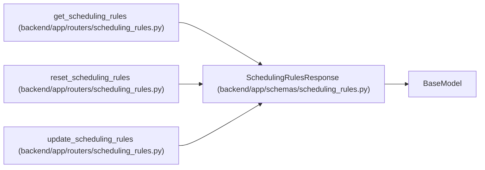

# SchedulingRulesResponse

**Location:** `backend/app/schemas/scheduling_rules.py:64`
**Kind:** Pydantic model
**Bases:** `BaseModel`
**Module:** [schemas_scheduling_rules](../modules/schemas_scheduling_rules.md)

## Description

Response wrapper for scheduling rules.

## Attributes

| Name | Type | Wire name | Required | Nullable | Default | Constraints | Examples | Description |
|------|------|-----------|----------|----------|---------|-------------|-------------|----------|
| `rules` | `SchedulingRulesSchema` | `rules` | Yes | No | — | — | — | — |
| `source` | `str` | `source` | Yes | No | — | — | — | Source of rules: 'yaml', 'database', or 'defaults' |

## Methods

*No public methods. Inherits from base classes.*

## Relationships

<!-- Auto-generated relationship summary. Do not edit by hand. -->

### Summary

| Module | Methods | Attributes |
|---|---:|---|
| [schemas_scheduling_rules](../modules/schemas_scheduling_rules.md) | 0 | `rules`, `source` |

### Structure

| Kind | Entity | Module |
|---|---|---|
| Base | `BaseModel` | — |

### References

| Reference | Kind | Source | Call sites |
|---|---|---|---:|
| `get_scheduling_rules` | call | [routers_scheduling_rules](../modules/routers_scheduling_rules.md) | 1 |
| `get_scheduling_rules` | type_reference | [routers_scheduling_rules](../modules/routers_scheduling_rules.md) | — |
| `reset_scheduling_rules` | call | [routers_scheduling_rules](../modules/routers_scheduling_rules.md) | 1 |
| `reset_scheduling_rules` | type_reference | [routers_scheduling_rules](../modules/routers_scheduling_rules.md) | — |
| `update_scheduling_rules` | call | [routers_scheduling_rules](../modules/routers_scheduling_rules.md) | 1 |
| `update_scheduling_rules` | type_reference | [routers_scheduling_rules](../modules/routers_scheduling_rules.md) | — |
