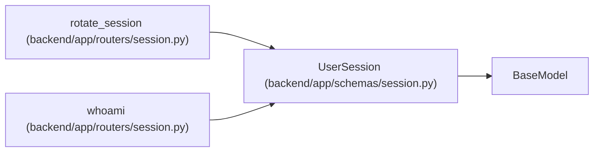

# UserSession

**Location:** `backend/app/schemas/session.py:5`
**Kind:** Pydantic model
**Bases:** `BaseModel`
**Module:** [schemas_session](../modules/schemas_session.md)

## Description

Privacy-safe browser session response.

## Model Configuration

| Setting | Value | Source |
|---------|-------|--------|
| `from_attributes` | `True` | model_config |

## Attributes

| Name | Type | Wire name | Required | Nullable | Default | Constraints | Examples | Description |
|------|------|-----------|----------|----------|---------|-------------|-------------|----------|
| `id` | `int` | `id` | Yes | No | — | — | — | — |
| `public_id` | `str` | `public_id` | Yes | No | — | — | — | — |
| `display_name` | `str` | `display_name` | Yes | No | — | — | — | — |
| `principal_id` | `int \| None` | `principal_id` | No | Yes | `None` | — | — | — |
| `authenticated` | `bool` | `authenticated` | No | No | `False` | — | — | — |
| `created_at` | `datetime` | `created_at` | Yes | No | — | — | — | — |
| `last_seen_at` | `datetime` | `last_seen_at` | Yes | No | — | — | — | — |

## Methods

*No public methods. Inherits from base classes.*

## Relationships

<!-- Auto-generated relationship summary. Do not edit by hand. -->

### Summary

| Module | Methods | Attributes |
|---|---:|---|
| [schemas_session](../modules/schemas_session.md) | 0 | `authenticated`, `created_at`, `display_name`, `id`, `last_seen_at`, `principal_id`, `public_id` |

### Structure

| Kind | Entity | Module |
|---|---|---|
| Base | `BaseModel` | — |

### References

| Reference | Kind | Source | Call sites |
|---|---|---|---:|
| `rotate_session` | type_reference | [routers_session](../modules/routers_session.md) | — |
| `whoami` | type_reference | [routers_session](../modules/routers_session.md) | — |
