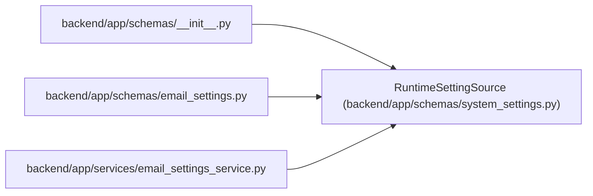

# RuntimeSettingSource

**Location:** `backend/app/schemas/system_settings.py:7`
**Kind:** Type alias
**Bases:** —
**Module:** [schemas_system_settings](../modules/schemas_system_settings.md)
**Target:** `Literal['runtime', 'environment', 'default']`

## Description

_Auto-generated from `RuntimeSettingSource` in `backend/app/schemas/system_settings.py`._

## Attributes

*No annotated attributes found.*

## Methods

*No public methods. Inherits from base classes.*

## Relationships

<!-- Auto-generated relationship summary. Do not edit by hand. -->

### Summary

| Module | Methods | Attributes |
|---|---:|---|
| [schemas_system_settings](../modules/schemas_system_settings.md) | 0 | — |

### References

| Reference | Kind | Source | Call sites |
|---|---|---|---:|
| `__init__` | import | [schemas___init__](../modules/schemas___init__.md) | — |
| `email_settings` | import | [schemas_email_settings](../modules/schemas_email_settings.md) | — |
| `email_settings_service` | import | [email_settings_service](../modules/email_settings_service.md) | — |
