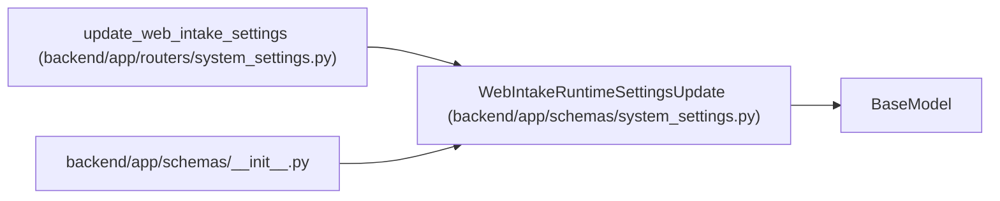

# WebIntakeRuntimeSettingsUpdate

**Location:** `backend/app/schemas/system_settings.py:82`
**Kind:** Pydantic model
**Bases:** `BaseModel`
**Module:** [schemas_system_settings](../modules/schemas_system_settings.md)

## Description

Update request for controlled web-intake runtime settings.

## Attributes

| Name | Type | Wire name | Required | Nullable | Default | Constraints | Examples | Description |
|------|------|-----------|----------|----------|---------|-------------|-------------|----------|
| `token` | `str \| None` | `token` | No | Yes | `None` | — | — | — |
| `clear_token` | `bool` | `clear_token` | No | No | `False` | — | — | — |
| `rate_limit_per_minute` | `int \| None` | `rate_limit_per_minute` | No | Yes | `None` | ge=1; le=10000 | — | — |
| `reset_fields` | `list[str]` | `reset_fields` | No | No | factory: `list` | — | — | — |

## Methods

*No public methods. Inherits from base classes.*

## Relationships

<!-- Auto-generated relationship summary. Do not edit by hand. -->

### Summary

| Module | Methods | Attributes |
|---|---:|---|
| [schemas_system_settings](../modules/schemas_system_settings.md) | 0 | `clear_token`, `rate_limit_per_minute`, `reset_fields`, `token` |

### Structure

| Kind | Entity | Module |
|---|---|---|
| Base | `BaseModel` | — |

### References

| Reference | Kind | Source | Call sites |
|---|---|---|---:|
| `update_web_intake_settings` | type_reference | [routers_system_settings](../modules/routers_system_settings.md) | — |
| `__init__` | import | [schemas___init__](../modules/schemas___init__.md) | — |
