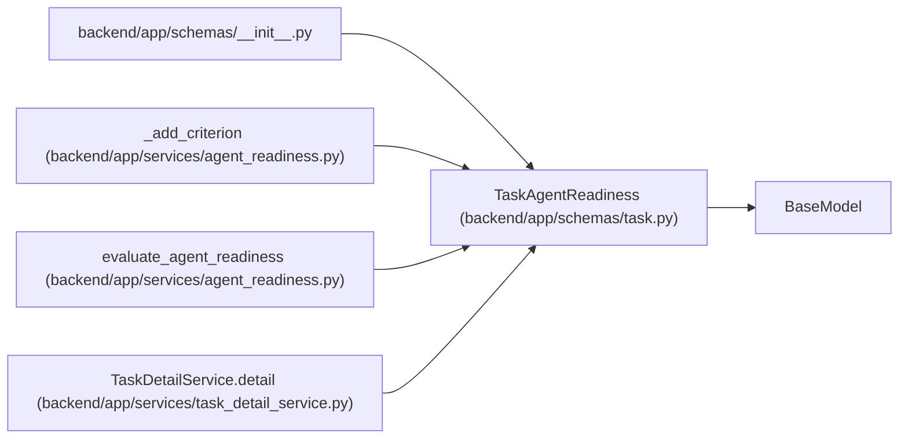

# TaskAgentReadiness

**Location:** `backend/app/schemas/task.py:176`
**Kind:** Pydantic model
**Bases:** `BaseModel`
**Module:** [schemas_task](../modules/schemas_task.md)

## Description

Computed advisory readiness for agent execution.

## Attributes

| Name | Type | Wire name | Required | Nullable | Default | Constraints | Examples | Description |
|------|------|-----------|----------|----------|---------|-------------|-------------|----------|
| `is_ready` | `bool` | `is_ready` | No | No | `False` | — | — | — |
| `definition_ready` | `bool` | `definition_ready` | No | No | `False` | — | — | — |
| `start_ready` | `bool` | `start_ready` | No | No | `False` | — | — | — |
| `blocker_codes` | `list[str]` | `blocker_codes` | No | No | factory: `list` | — | — | — |
| `blockers` | `list[str]` | `blockers` | No | No | factory: `list` | — | — | — |
| `warnings` | `list[str]` | `warnings` | No | No | factory: `list` | — | — | — |
| `criteria` | `list[TaskAgentReadinessCriterion]` | `criteria` | No | No | factory: `list` | — | — | — |

## Methods

*No public methods. Inherits from base classes.*

## Relationships

<!-- Auto-generated relationship summary. Do not edit by hand. -->

### Summary

| Module | Methods | Attributes |
|---|---:|---|
| [schemas_task](../modules/schemas_task.md) | 0 | `blocker_codes`, `blockers`, `criteria`, `definition_ready`, `is_ready`, `start_ready`, `warnings` |

### Structure

| Kind | Entity | Module |
|---|---|---|
| Base | `BaseModel` | — |

### References

| Reference | Kind | Source | Call sites |
|---|---|---|---:|
| `__init__` | import | [schemas___init__](../modules/schemas___init__.md) | — |
| `_add_criterion` | type_reference | [agent_readiness](../modules/agent_readiness.md) | — |
| `evaluate_agent_readiness` | call | [agent_readiness](../modules/agent_readiness.md) | 1 |
| `evaluate_agent_readiness` | type_reference | [agent_readiness](../modules/agent_readiness.md) | — |
| `TaskDetailService.detail` | call | [task_detail_service](../modules/task_detail_service.md) | 1 |
