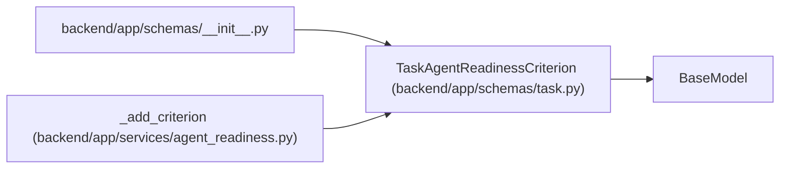

# TaskAgentReadinessCriterion

**Location:** `backend/app/schemas/task.py:167`
**Kind:** Pydantic model
**Bases:** `BaseModel`
**Module:** [schemas_task](../modules/schemas_task.md)

## Description

One deterministic criterion used for agent-readiness evaluation.

## Attributes

| Name | Type | Wire name | Required | Nullable | Default | Constraints | Examples | Description |
|------|------|-----------|----------|----------|---------|-------------|-------------|----------|
| `key` | `str` | `key` | Yes | No | — | — | — | — |
| `label` | `str` | `label` | Yes | No | — | — | — | — |
| `passed` | `bool` | `passed` | Yes | No | — | — | — | — |
| `reason` | `str` | `reason` | Yes | No | — | — | — | — |

## Methods

*No public methods. Inherits from base classes.*

## Relationships

<!-- Auto-generated relationship summary. Do not edit by hand. -->

### Summary

| Module | Methods | Attributes |
|---|---:|---|
| [schemas_task](../modules/schemas_task.md) | 0 | `key`, `label`, `passed`, `reason` |

### Structure

| Kind | Entity | Module |
|---|---|---|
| Base | `BaseModel` | — |

### References

| Reference | Kind | Source | Call sites |
|---|---|---|---:|
| `__init__` | import | [schemas___init__](../modules/schemas___init__.md) | — |
| `_add_criterion` | call | [agent_readiness](../modules/agent_readiness.md) | 1 |
| `_add_criterion` | type_reference | [agent_readiness](../modules/agent_readiness.md) | — |
