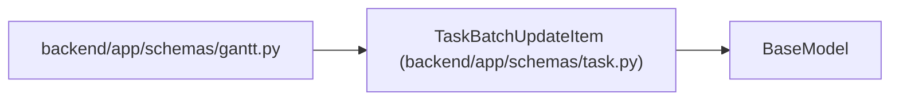

# TaskBatchUpdateItem

**Location:** `backend/app/schemas/task.py:397`
**Kind:** Pydantic model
**Bases:** `BaseModel`
**Module:** [schemas_task](../modules/schemas_task.md)

## Description

Schema for a single task update item in a batch.

## Attributes

| Name | Type | Wire name | Required | Nullable | Default | Constraints | Examples | Description |
|------|------|-----------|----------|----------|---------|-------------|-------------|----------|
| `task_id` | `int` | `task_id` | Yes | No | — | — | — | — |
| `update` | `TaskUpdate` | `update` | Yes | No | — | — | — | — |
| `status_reason` | `Optional[str]` | `status_reason` | No | Yes | `None` | — | — | — |
| `expected_version` | `Optional[int]` | `expected_version` | No | Yes | `None` | ge=1 | — | — |

## Methods

*No public methods. Inherits from base classes.*

## Relationships

<!-- Auto-generated relationship summary. Do not edit by hand. -->

### Summary

| Module | Methods | Attributes |
|---|---:|---|
| [schemas_task](../modules/schemas_task.md) | 0 | `expected_version`, `status_reason`, `task_id`, `update` |

### Structure

| Kind | Entity | Module |
|---|---|---|
| Base | `BaseModel` | — |

### References

| Reference | Kind | Source | Call sites |
|---|---|---|---:|
| `gantt` | import | [schemas_gantt](../modules/schemas_gantt.md) | — |
