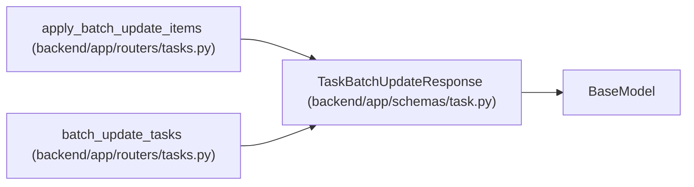

# TaskBatchUpdateResponse

**Location:** `backend/app/schemas/task.py:451`
**Kind:** Pydantic model
**Bases:** `BaseModel`
**Module:** [schemas_task](../modules/schemas_task.md)

## Description

Response schema for a batch task update.

## Attributes

| Name | Type | Wire name | Required | Nullable | Default | Constraints | Examples | Description |
|------|------|-----------|----------|----------|---------|-------------|-------------|----------|
| `results` | `list[TaskBatchUpdateResponseItem]` | `results` | Yes | No | — | — | — | — |
| `updated_tasks` | `list[TaskResponse]` | `updated_tasks` | Yes | No | — | — | — | — |
| `schedule_result` | `Optional[Any]` | `schedule_result` | No | Yes | `None` | — | — | — |

## Methods

*No public methods. Inherits from base classes.*

## Relationships

<!-- Auto-generated relationship summary. Do not edit by hand. -->

### Summary

| Module | Methods | Attributes |
|---|---:|---|
| [schemas_task](../modules/schemas_task.md) | 0 | `results`, `schedule_result`, `updated_tasks` |

### Structure

| Kind | Entity | Module |
|---|---|---|
| Base | `BaseModel` | — |

### References

| Reference | Kind | Source | Call sites |
|---|---|---|---:|
| `apply_batch_update_items` | type_reference | [tasks](../modules/tasks.md) | — |
| `batch_update_tasks` | call | [tasks](../modules/tasks.md) | 1 |
| `batch_update_tasks` | type_reference | [tasks](../modules/tasks.md) | — |
