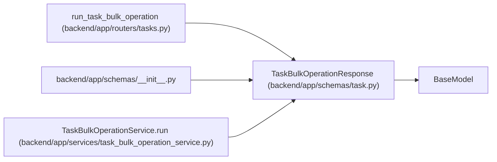

# TaskBulkOperationResponse

**Location:** `backend/app/schemas/task.py:315`
**Kind:** Pydantic model
**Bases:** `BaseModel`
**Module:** [schemas_task](../modules/schemas_task.md)

## Description

Response for selected-task bulk operations.

## Attributes

| Name | Type | Wire name | Required | Nullable | Default | Constraints | Examples | Description |
|------|------|-----------|----------|----------|---------|-------------|-------------|----------|
| `input_revisions` | `dict[int, int]` | `input_revisions` | No | No | factory: `dict` | — | — | — |
| `task_versions` | `dict[int, int]` | `task_versions` | No | No | factory: `dict` | — | — | — |
| `requested_count` | `int` | `requested_count` | Yes | No | — | — | — | — |
| `succeeded_count` | `int` | `succeeded_count` | Yes | No | — | — | — | — |
| `failed_count` | `int` | `failed_count` | Yes | No | — | — | — | — |
| `dry_run` | `bool` | `dry_run` | Yes | No | — | — | — | — |
| `results` | `list[TaskBulkOperationResult]` | `results` | No | No | factory: `list` | — | — | — |

## Methods

*No public methods. Inherits from base classes.*

## Relationships

<!-- Auto-generated relationship summary. Do not edit by hand. -->

### Summary

| Module | Methods | Attributes |
|---|---:|---|
| [schemas_task](../modules/schemas_task.md) | 0 | `dry_run`, `failed_count`, `input_revisions`, `requested_count`, `results`, `succeeded_count`, `task_versions` |

### Structure

| Kind | Entity | Module |
|---|---|---|
| Base | `BaseModel` | — |

### References

| Reference | Kind | Source | Call sites |
|---|---|---|---:|
| `run_task_bulk_operation` | type_reference | [tasks](../modules/tasks.md) | — |
| `__init__` | import | [schemas___init__](../modules/schemas___init__.md) | — |
| `TaskBulkOperationService.run` | call | [task_bulk_operation_service](../modules/task_bulk_operation_service.md) | 1 |
| `TaskBulkOperationService.run` | type_reference | [task_bulk_operation_service](../modules/task_bulk_operation_service.md) | — |
