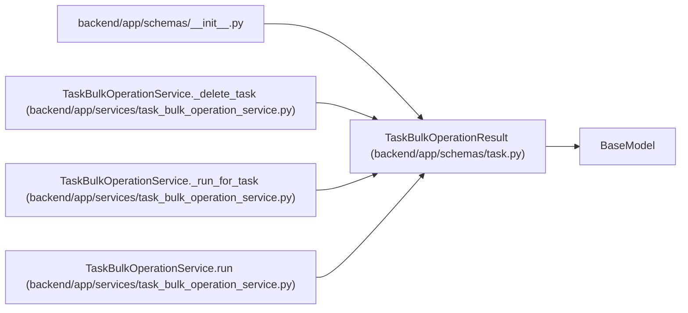

# TaskBulkOperationResult

**Location:** `backend/app/schemas/task.py:304`
**Kind:** Pydantic model
**Bases:** `BaseModel`
**Module:** [schemas_task](../modules/schemas_task.md)

## Description

Per-task result returned by a selected-task bulk operation.

## Attributes

| Name | Type | Wire name | Required | Nullable | Default | Constraints | Examples | Description |
|------|------|-----------|----------|----------|---------|-------------|-------------|----------|
| `task_id` | `int` | `task_id` | Yes | No | — | — | — | — |
| `outcome` | `TaskBulkOutcome` | `outcome` | Yes | No | — | — | — | — |
| `changes` | `dict[str, Any]` | `changes` | No | No | factory: `dict` | — | — | — |
| `warnings` | `list[str]` | `warnings` | No | No | factory: `list` | — | — | — |
| `error` | `Optional[str]` | `error` | No | Yes | `None` | — | — | — |
| `task` | `Optional[TaskResponse]` | `task` | No | Yes | `None` | — | — | — |
| `assignee_recommendation` | `Optional[AssigneeRecommendationResponse]` | `assignee_recommendation` | No | Yes | `None` | — | — | — |

## Methods

*No public methods. Inherits from base classes.*

## Relationships

<!-- Auto-generated relationship summary. Do not edit by hand. -->

### Summary

| Module | Methods | Attributes |
|---|---:|---|
| [schemas_task](../modules/schemas_task.md) | 0 | `assignee_recommendation`, `changes`, `error`, `outcome`, `task`, `task_id`, `warnings` |

### Structure

| Kind | Entity | Module |
|---|---|---|
| Base | `BaseModel` | — |

### References

| Reference | Kind | Source | Call sites |
|---|---|---|---:|
| `__init__` | import | [schemas___init__](../modules/schemas___init__.md) | — |
| `TaskBulkOperationService._delete_task` | call | [task_bulk_operation_service](../modules/task_bulk_operation_service.md) | 3 |
| `TaskBulkOperationService._delete_task` | type_reference | [task_bulk_operation_service](../modules/task_bulk_operation_service.md) | — |
| `TaskBulkOperationService._run_for_task` | call | [task_bulk_operation_service](../modules/task_bulk_operation_service.md) | 3 |
| `TaskBulkOperationService._run_for_task` | type_reference | [task_bulk_operation_service](../modules/task_bulk_operation_service.md) | — |
| `TaskBulkOperationService.run` | call | [task_bulk_operation_service](../modules/task_bulk_operation_service.md) | 3 |
