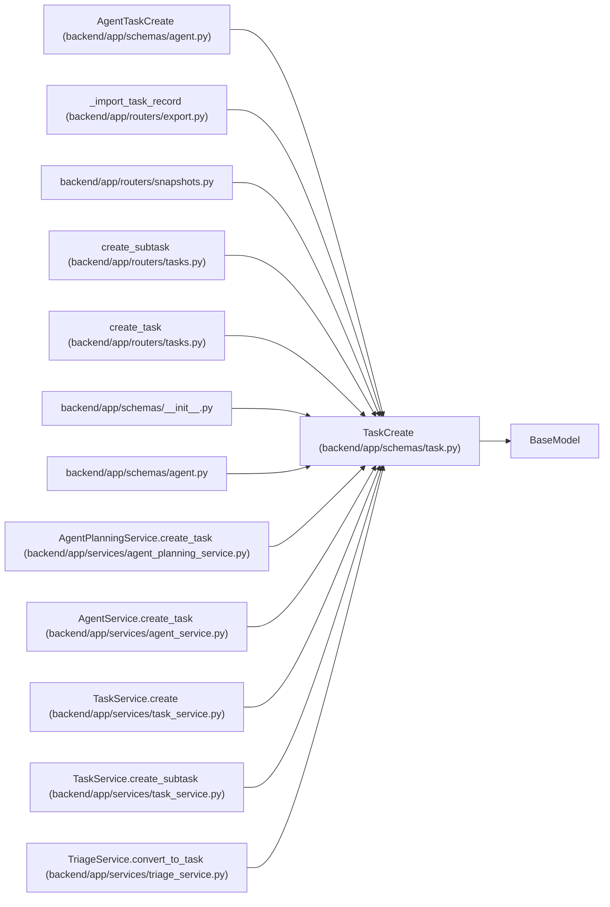

# TaskCreate

**Location:** `backend/app/schemas/task.py:35`
**Kind:** Pydantic model
**Bases:** `BaseModel`
**Module:** [schemas_task](../modules/schemas_task.md)

## Description

Schema for creating a task.

## Validators

| Method | Scope | Fields | Mode | Options |
|--------|-------|--------|------|---------|
| `validate_source_url` | field | source_url | after | — |

## Attributes

| Name | Type | Wire name | Required | Nullable | Default | Constraints | Examples | Description |
|------|------|-----------|----------|----------|---------|-------------|-------------|----------|
| `title` | `str` | `title` | Yes | No | — | min_length=1; max_length=500 | — | — |
| `description` | `Optional[str]` | `description` | No | Yes | `None` | — | — | — |
| `parent_id` | `Optional[int]` | `parent_id` | No | Yes | `None` | — | — | — |
| `priority` | `int` | `priority` | No | No | `5` | ge=1; le=10 | — | — |
| `effort_days` | `float` | `effort_days` | No | No | `1.0` | ge=0.1 | — | — |
| `effort_hours` | `Optional[float]` | `effort_hours` | No | Yes | `None` | — | — | — |
| `assignee_id` | `Optional[int]` | `assignee_id` | No | Yes | `None` | — | — | — |
| `project_id` | `Optional[int]` | `project_id` | No | Yes | `None` | — | — | — |
| `milestone_id` | `Optional[int]` | `milestone_id` | No | Yes | `None` | — | — | — |
| `depends_on` | `list[int]` | `depends_on` | No | No | factory: `list` | — | — | Task IDs |
| `is_optional` | `bool` | `is_optional` | No | No | `False` | — | — | — |
| `is_deferred` | `bool` | `is_deferred` | No | No | `False` | — | — | — |
| `tags` | `list[str]` | `tags` | No | No | factory: `list` | — | — | — |
| `sort_order` | `int` | `sort_order` | No | No | `0` | — | — | — |
| `min_start_date` | `Optional[date]` | `min_start_date` | No | Yes | `None` | — | — | — |
| `max_end_date` | `Optional[date]` | `max_end_date` | No | Yes | `None` | — | — | — |
| `external_key` | `Optional[str]` | `external_key` | No | Yes | `None` | max_length=255 | — | — |
| `source` | `Optional[str]` | `source` | No | Yes | `None` | max_length=100 | — | — |
| `source_url` | `Optional[str]` | `source_url` | No | Yes | `None` | max_length=1000 | — | — |

## Methods

| Method | Signature | Decorators | Description |
|--------|-----------|------------|-------------|
| `validate_source_url` | `(value: Optional[str]) -> Optional[str]` | `@field_validator('source_url')`, `@classmethod` | — |

## Relationships

<!-- Auto-generated relationship summary. Do not edit by hand. -->

### Summary

| Module | Methods | Attributes |
|---|---:|---|
| [schemas_task](../modules/schemas_task.md) | 1 | `assignee_id`, `depends_on`, `description`, `effort_days`, `effort_hours`, `external_key`, `is_deferred`, `is_optional`, `max_end_date`, `milestone_id`, `min_start_date`, `parent_id` |

### Structure

| Kind | Entity | Module |
|---|---|---|
| Base | `BaseModel` | — |
| Subclass | `AgentTaskCreate` | [schemas_agent](../modules/schemas_agent.md) |

### References

| Reference | Kind | Source | Call sites |
|---|---|---|---:|
| `_import_task_record` | call | [export](../modules/export.md) | 1 |
| `snapshots` | import | [snapshots](../modules/snapshots.md) | — |
| `create_subtask` | type_reference | [tasks](../modules/tasks.md) | — |
| `create_task` | type_reference | [tasks](../modules/tasks.md) | — |
| `__init__` | import | [schemas___init__](../modules/schemas___init__.md) | — |
| `agent` | import | [schemas_agent](../modules/schemas_agent.md) | — |
| `AgentPlanningService.create_task` | type_reference | [agent_planning_service](../modules/agent_planning_service.md) | — |
| `AgentService.create_task` | call | [agent_service](../modules/agent_service.md) | 1 |
| `AgentService.create_task` | type_reference | [agent_service](../modules/agent_service.md) | — |
| `TaskService.create` | type_reference | [task_service](../modules/task_service.md) | — |
| `TaskService.create_subtask` | type_reference | [task_service](../modules/task_service.md) | — |
| `TriageService.convert_to_task` | call | [triage_service](../modules/triage_service.md) | 1 |
