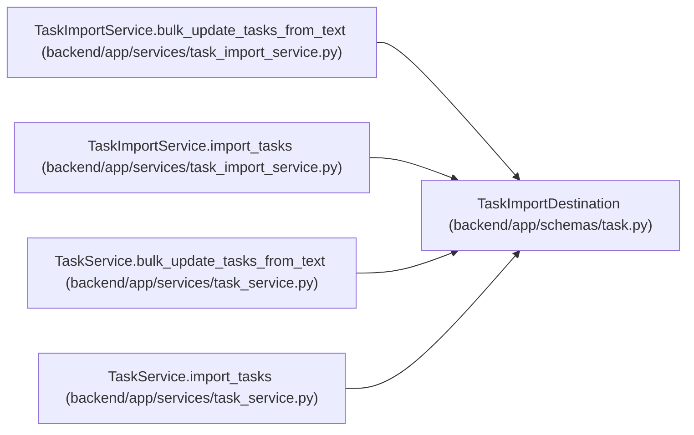

# TaskImportDestination

**Location:** `backend/app/schemas/task.py:325`
**Kind:** Type alias
**Bases:** —
**Module:** [schemas_task](../modules/schemas_task.md)
**Target:** `Literal['tasks', 'triage', 'auto']`

## Description

_Auto-generated from `TaskImportDestination` in `backend/app/schemas/task.py`._

## Attributes

*No annotated attributes found.*

## Methods

*No public methods. Inherits from base classes.*

## Relationships

<!-- Auto-generated relationship summary. Do not edit by hand. -->

### Summary

| Module | Methods | Attributes |
|---|---:|---|
| [schemas_task](../modules/schemas_task.md) | 0 | — |

### References

| Reference | Kind | Source | Call sites |
|---|---|---|---:|
| `TaskImportService.bulk_update_tasks_from_text` | type_reference | [task_import_service](../modules/task_import_service.md) | — |
| `TaskImportService.import_tasks` | type_reference | [task_import_service](../modules/task_import_service.md) | — |
| `TaskService.bulk_update_tasks_from_text` | type_reference | [task_service](../modules/task_service.md) | — |
| `TaskService.import_tasks` | type_reference | [task_service](../modules/task_service.md) | — |
