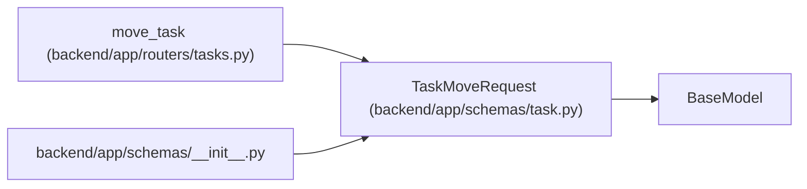

# TaskMoveRequest

**Location:** `backend/app/schemas/task.py:116`
**Kind:** Pydantic model
**Bases:** `BaseModel`
**Module:** [schemas_task](../modules/schemas_task.md)

## Description

Schema for moving a task subtree to another iteration.

## Attributes

| Name | Type | Wire name | Required | Nullable | Default | Constraints | Examples | Description |
|------|------|-----------|----------|----------|---------|-------------|-------------|----------|
| `expected_revisions` | `dict[int, int]` | `expected_revisions` | No | No | factory: `dict` | — | — | — |
| `iteration_id` | `int` | `iteration_id` | Yes | No | — | — | — | — |
| `parent_id` | `Optional[int]` | `parent_id` | No | Yes | `None` | — | — | — |
| `expected_version` | `Optional[int]` | `expected_version` | No | Yes | `None` | ge=1 | — | — |

## Methods

*No public methods. Inherits from base classes.*

## Relationships

<!-- Auto-generated relationship summary. Do not edit by hand. -->

### Summary

| Module | Methods | Attributes |
|---|---:|---|
| [schemas_task](../modules/schemas_task.md) | 0 | `expected_revisions`, `expected_version`, `iteration_id`, `parent_id` |

### Structure

| Kind | Entity | Module |
|---|---|---|
| Base | `BaseModel` | — |

### References

| Reference | Kind | Source | Call sites |
|---|---|---|---:|
| `move_task` | type_reference | [tasks](../modules/tasks.md) | — |
| `__init__` | import | [schemas___init__](../modules/schemas___init__.md) | — |
