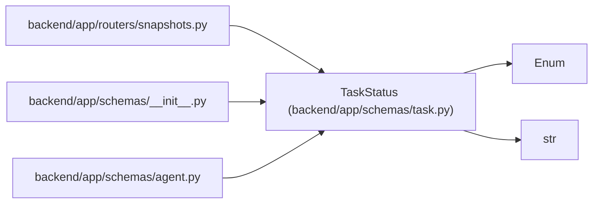

# TaskStatus

**Location:** `backend/app/schemas/task.py:27`
**Kind:** Enum
**Bases:** `str`, `Enum`
**Module:** [schemas_task](../modules/schemas_task.md)

## Description

Task status enumeration for work tracking.

Workflow: PLANNED -> ACTIVE -> RESOLVED -> CLOSED

## Attributes

| Name | Declared value | Description |
|------|-------|-------------|
| `PLANNED` | `'planned'` | — |
| `ACTIVE` | `'active'` | — |
| `RESOLVED` | `'resolved'` | — |
| `CLOSED` | `'closed'` | — |

## Methods

*No public methods. Inherits from base classes.*

## Relationships

<!-- Auto-generated relationship summary. Do not edit by hand. -->

### Summary

| Module | Methods | Attributes |
|---|---:|---|
| [schemas_task](../modules/schemas_task.md) | 0 | `ACTIVE`, `CLOSED`, `PLANNED`, `RESOLVED` |

### Structure

| Kind | Entity | Module |
|---|---|---|
| Base | `Enum` | — |
| Base | `str` | — |

### References

| Reference | Kind | Source | Call sites |
|---|---|---|---:|
| `snapshots` | import | [snapshots](../modules/snapshots.md) | — |
| `__init__` | import | [schemas___init__](../modules/schemas___init__.md) | — |
| `agent` | import | [schemas_agent](../modules/schemas_agent.md) | — |
