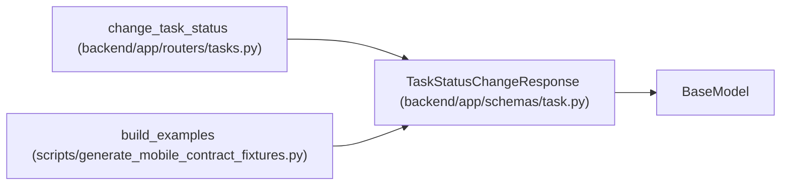

# TaskStatusChangeResponse

**Location:** `backend/app/schemas/task.py:413`
**Kind:** Pydantic model
**Bases:** `BaseModel`
**Module:** [schemas_task](../modules/schemas_task.md)

## Description

Response for status change with cascade info.

## Attributes

| Name | Type | Wire name | Required | Nullable | Default | Constraints | Examples | Description |
|------|------|-----------|----------|----------|---------|-------------|-------------|----------|
| `task` | `TaskResponse` | `task` | Yes | No | — | — | — | — |
| `cascade_updates` | `list[CascadeUpdateInfo]` | `cascade_updates` | No | No | `[]` | — | — | — |
| `notifications_sent` | `bool` | `notifications_sent` | No | No | `False` | — | — | — |

## Methods

*No public methods. Inherits from base classes.*

## Relationships

<!-- Auto-generated relationship summary. Do not edit by hand. -->

### Summary

| Module | Methods | Attributes |
|---|---:|---|
| [schemas_task](../modules/schemas_task.md) | 0 | `cascade_updates`, `notifications_sent`, `task` |

### Structure

| Kind | Entity | Module |
|---|---|---|
| Base | `BaseModel` | — |

### References

| Reference | Kind | Source | Call sites |
|---|---|---|---:|
| `change_task_status` | call | [tasks](../modules/tasks.md) | 1 |
| `change_task_status` | type_reference | [tasks](../modules/tasks.md) | — |
| `build_examples` | call | [generate_mobile_contract_fixtures](../modules/generate_mobile_contract_fixtures.md) | 1 |
