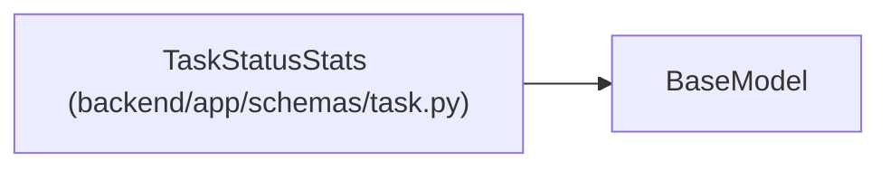

# TaskStatusStats

**Location:** `backend/app/schemas/task.py:349`
**Kind:** Pydantic model
**Bases:** `BaseModel`
**Module:** [schemas_task](../modules/schemas_task.md)

## Description

Response for status transition statistics (aggregated).

## Attributes

| Name | Type | Wire name | Required | Nullable | Default | Constraints | Examples | Description |
|------|------|-----------|----------|----------|---------|-------------|-------------|----------|
| `from_status` | `str` | `from_status` | Yes | No | — | — | — | — |
| `to_status` | `str` | `to_status` | Yes | No | — | — | — | — |
| `count` | `int` | `count` | Yes | No | — | — | — | — |

## Methods

*No public methods. Inherits from base classes.*

## Relationships

<!-- Auto-generated relationship summary. Do not edit by hand. -->

### Summary

| Module | Methods | Attributes |
|---|---:|---|
| [schemas_task](../modules/schemas_task.md) | 0 | `count`, `from_status`, `to_status` |

### Structure

| Kind | Entity | Module |
|---|---|---|
| Base | `BaseModel` | — |
