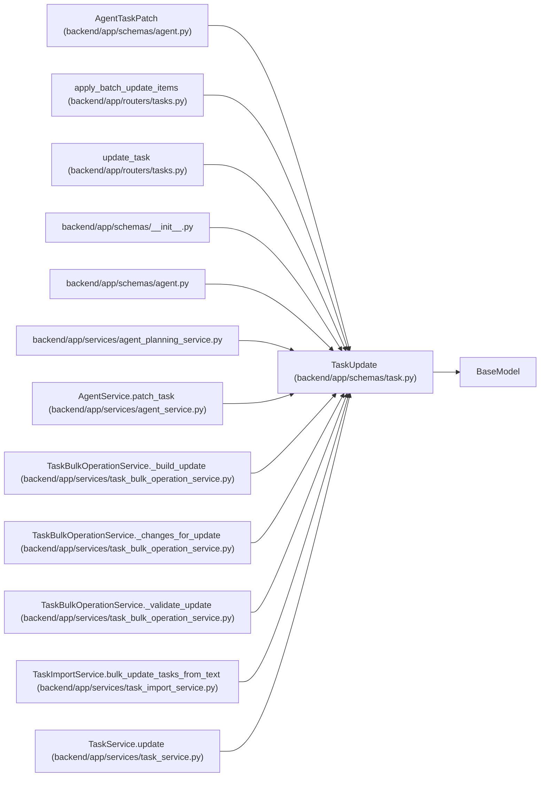

# TaskUpdate

**Location:** `backend/app/schemas/task.py:70`
**Kind:** Pydantic model
**Bases:** `BaseModel`
**Module:** [schemas_task](../modules/schemas_task.md)

## Description

Schema for updating a task.

## Validators

| Method | Scope | Fields | Mode | Options |
|--------|-------|--------|------|---------|
| `validate_source_url` | field | source_url | after | — |

## Attributes

| Name | Type | Wire name | Required | Nullable | Default | Constraints | Examples | Description |
|------|------|-----------|----------|----------|---------|-------------|-------------|----------|
| `expected_version` | `Optional[int]` | `expected_version` | No | Yes | `None` | ge=1 | — | — |
| `title` | `Optional[str]` | `title` | No | Yes | `None` | min_length=1; max_length=500 | — | — |
| `description` | `Optional[str]` | `description` | No | Yes | `None` | — | — | — |
| `priority` | `Optional[int]` | `priority` | No | Yes | `None` | ge=1; le=10 | — | — |
| `effort_days` | `Optional[float]` | `effort_days` | No | Yes | `None` | ge=0; allow_inf_nan=False | — | — |
| `effort_hours` | `Optional[float]` | `effort_hours` | No | Yes | `None` | ge=0; allow_inf_nan=False | — | — |
| `owner_profile_id` | `Optional[int]` | `owner_profile_id` | No | Yes | `None` | ge=1 | — | — |
| `brief` | `Optional[TaskBrief]` | `brief` | No | Yes | `None` | — | — | — |
| `estimate_provenance` | `Optional[Literal['unknown', 'assumed', 'estimated']]` | `estimate_provenance` | No | Yes | `None` | — | — | — |
| `assignee_id` | `Optional[int]` | `assignee_id` | No | Yes | `None` | — | — | — |
| `project_id` | `Optional[int]` | `project_id` | No | Yes | `None` | — | — | — |
| `milestone_id` | `Optional[int]` | `milestone_id` | No | Yes | `None` | — | — | — |
| `status` | `Optional[TaskStatus]` | `status` | No | Yes | `None` | — | — | — |
| `is_optional` | `Optional[bool]` | `is_optional` | No | Yes | `None` | — | — | — |
| `is_deferred` | `Optional[bool]` | `is_deferred` | No | Yes | `None` | — | — | — |
| `tags` | `Optional[list[str]]` | `tags` | No | Yes | `None` | — | — | — |
| `sort_order` | `Optional[int]` | `sort_order` | No | Yes | `None` | — | — | — |
| `depends_on` | `Optional[list[int]]` | `depends_on` | No | Yes | `None` | — | — | Task IDs this task depends on |
| `min_start_date` | `Optional[date]` | `min_start_date` | No | Yes | `None` | — | — | — |
| `max_end_date` | `Optional[date]` | `max_end_date` | No | Yes | `None` | — | — | — |
| `external_key` | `Optional[str]` | `external_key` | No | Yes | `None` | max_length=255 | — | — |
| `source` | `Optional[str]` | `source` | No | Yes | `None` | max_length=100 | — | — |
| `source_url` | `Optional[str]` | `source_url` | No | Yes | `None` | max_length=1000 | — | — |

## Methods

| Method | Signature | Decorators | Description |
|--------|-----------|------------|-------------|
| `validate_source_url` | `(value: Optional[str]) -> Optional[str]` | `@field_validator('source_url')`, `@classmethod` | — |

## Relationships

<!-- Auto-generated relationship summary. Do not edit by hand. -->

### Summary

| Module | Methods | Attributes |
|---|---:|---|
| [schemas_task](../modules/schemas_task.md) | 1 | `assignee_id`, `brief`, `depends_on`, `description`, `effort_days`, `effort_hours`, `estimate_provenance`, `expected_version`, `external_key`, `is_deferred`, `is_optional`, `max_end_date` |

### Structure

| Kind | Entity | Module |
|---|---|---|
| Base | `BaseModel` | — |
| Subclass | `AgentTaskPatch` | [schemas_agent](../modules/schemas_agent.md) |

### References

| Reference | Kind | Source | Call sites |
|---|---|---|---:|
| `apply_batch_update_items` | call | [tasks](../modules/tasks.md) | 2 |
| `update_task` | type_reference | [tasks](../modules/tasks.md) | — |
| `__init__` | import | [schemas___init__](../modules/schemas___init__.md) | — |
| `agent` | import | [schemas_agent](../modules/schemas_agent.md) | — |
| `agent_planning_service` | import | [agent_planning_service](../modules/agent_planning_service.md) | — |
| `AgentService.patch_task` | call | [agent_service](../modules/agent_service.md) | 1 |
| `TaskBulkOperationService._build_update` | call | [task_bulk_operation_service](../modules/task_bulk_operation_service.md) | 2 |
| `TaskBulkOperationService._build_update` | type_reference | [task_bulk_operation_service](../modules/task_bulk_operation_service.md) | — |
| `TaskBulkOperationService._changes_for_update` | type_reference | [task_bulk_operation_service](../modules/task_bulk_operation_service.md) | — |
| `TaskBulkOperationService._validate_update` | type_reference | [task_bulk_operation_service](../modules/task_bulk_operation_service.md) | — |
| `TaskImportService.bulk_update_tasks_from_text` | call | [task_import_service](../modules/task_import_service.md) | 1 |
| `TaskService.update` | type_reference | [task_service](../modules/task_service.md) | — |

> References: showing 12 of 29 logical references; 17 omitted by the 12-row generated summary limit.
