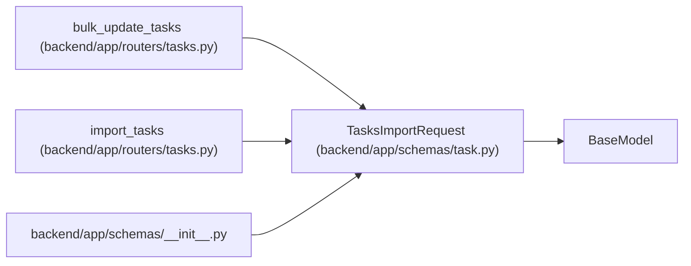

# TasksImportRequest

**Location:** `backend/app/schemas/task.py:281`
**Kind:** Pydantic model
**Bases:** `BaseModel`
**Module:** [schemas_task](../modules/schemas_task.md)

## Description

Request for importing tasks from text.

## Attributes

| Name | Type | Wire name | Required | Nullable | Default | Constraints | Examples | Description |
|------|------|-----------|----------|----------|---------|-------------|-------------|----------|
| `text` | `str` | `text` | Yes | No | — | min_length=1; max_length=unknown (MAX_TASK_TEXT_IMPORT_CHARS) | — | Text content with tasks |
| `destination` | `TaskImportDestination` | `destination` | No | No | `'tasks'` | — | — | Where parsed rows should be created: tasks, triage, or auto split. |

## Methods

*No public methods. Inherits from base classes.*

## Relationships

<!-- Auto-generated relationship summary. Do not edit by hand. -->

### Summary

| Module | Methods | Attributes |
|---|---:|---|
| [schemas_task](../modules/schemas_task.md) | 0 | `destination`, `text` |

### Structure

| Kind | Entity | Module |
|---|---|---|
| Base | `BaseModel` | — |

### References

| Reference | Kind | Source | Call sites |
|---|---|---|---:|
| `bulk_update_tasks` | type_reference | [tasks](../modules/tasks.md) | — |
| `import_tasks` | type_reference | [tasks](../modules/tasks.md) | — |
| `__init__` | import | [schemas___init__](../modules/schemas___init__.md) | — |
