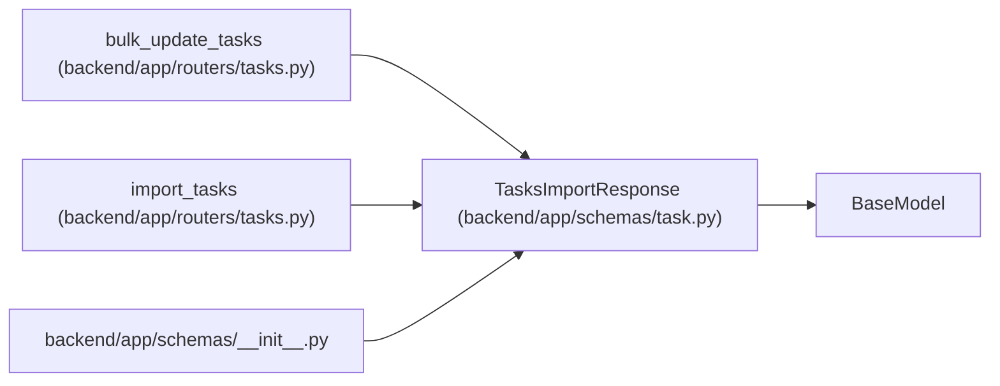

# TasksImportResponse

**Location:** `backend/app/schemas/task.py:320`
**Kind:** Pydantic model
**Bases:** `BaseModel`
**Module:** [schemas_task](../modules/schemas_task.md)

## Description

Response for task import.

## Attributes

| Name | Type | Wire name | Required | Nullable | Default | Constraints | Examples | Description |
|------|------|-----------|----------|----------|---------|-------------|-------------|----------|
| `imported_count` | `int` | `imported_count` | Yes | No | — | — | — | — |
| `task_count` | `int` | `task_count` | No | No | `0` | — | — | — |
| `triage_count` | `int` | `triage_count` | No | No | `0` | — | — | — |
| `tasks` | `list[TaskResponse]` | `tasks` | No | No | factory: `list` | — | — | — |
| `triage_items` | `list[TaskImportTriageItemResponse]` | `triage_items` | No | No | factory: `list` | — | — | — |

## Methods

*No public methods. Inherits from base classes.*

## Relationships

<!-- Auto-generated relationship summary. Do not edit by hand. -->

### Summary

| Module | Methods | Attributes |
|---|---:|---|
| [schemas_task](../modules/schemas_task.md) | 0 | `imported_count`, `task_count`, `tasks`, `triage_count`, `triage_items` |

### Structure

| Kind | Entity | Module |
|---|---|---|
| Base | `BaseModel` | — |

### References

| Reference | Kind | Source | Call sites |
|---|---|---|---:|
| `bulk_update_tasks` | call | [tasks](../modules/tasks.md) | 1 |
| `bulk_update_tasks` | type_reference | [tasks](../modules/tasks.md) | — |
| `import_tasks` | call | [tasks](../modules/tasks.md) | 1 |
| `import_tasks` | type_reference | [tasks](../modules/tasks.md) | — |
| `__init__` | import | [schemas___init__](../modules/schemas___init__.md) | — |
