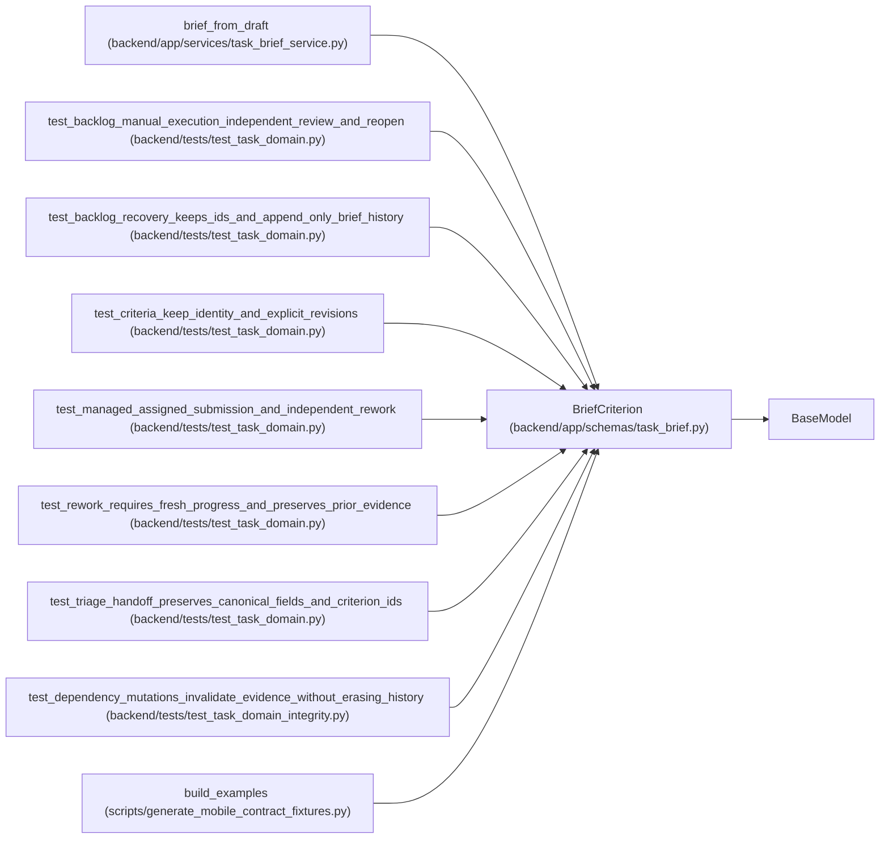

# BriefCriterion

**Location:** `backend/app/schemas/task_brief.py:10`
**Kind:** Pydantic model
**Bases:** `BaseModel`
**Module:** [schemas_task_brief](../modules/schemas_task_brief.md)

## Description

_Auto-generated from `BriefCriterion` in `backend/app/schemas/task_brief.py`._

## Model Configuration

| Setting | Value | Source |
|---------|-------|--------|
| `extra` | `'forbid'` | model_config |

## Validators

| Method | Scope | Fields | Mode | Options |
|--------|-------|--------|------|---------|
| `meaningful_text` | field | text | after | — |

## Attributes

| Name | Type | Wire name | Required | Nullable | Default | Constraints | Examples | Description |
|------|------|-----------|----------|----------|---------|-------------|-------------|----------|
| `id` | `str` | `id` | No | No | factory: `lambda: uuid4().hex` | min_length=1; max_length=64; pattern='^[a-zA-Z0-9_-]+$' | — | — |
| `revision` | `int` | `revision` | No | No | `1` | ge=1 | — | — |
| `text` | `str` | `text` | Yes | No | — | min_length=1; max_length=4000 | — | — |
| `verification` | `str` | `verification` | No | No | `''` | max_length=4000 | — | — |

## Methods

| Method | Signature | Decorators | Description |
|--------|-----------|------------|-------------|
| `meaningful_text` | `(value)` | `@field_validator('text')`, `@classmethod` | — |

## Relationships

<!-- Auto-generated relationship summary. Do not edit by hand. -->

### Summary

| Module | Methods | Attributes |
|---|---:|---|
| [schemas_task_brief](../modules/schemas_task_brief.md) | 1 | `id`, `revision`, `text`, `verification` |

### Structure

| Kind | Entity | Module |
|---|---|---|
| Base | `BaseModel` | — |

### References

| Reference | Kind | Source | Call sites |
|---|---|---|---:|
| `brief_from_draft` | call | [task_brief_service](../modules/task_brief_service.md) | 1 |
| `test_backlog_manual_execution_independent_review_and_reopen` | call | [test_task_domain](../modules/test_task_domain.md) | 1 |
| `test_backlog_recovery_keeps_ids_and_append_only_brief_history` | call | [test_task_domain](../modules/test_task_domain.md) | 1 |
| `test_criteria_keep_identity_and_explicit_revisions` | call | [test_task_domain](../modules/test_task_domain.md) | 1 |
| `test_managed_assigned_submission_and_independent_rework` | call | [test_task_domain](../modules/test_task_domain.md) | 1 |
| `test_rework_requires_fresh_progress_and_preserves_prior_evidence` | call | [test_task_domain](../modules/test_task_domain.md) | 1 |
| `test_triage_handoff_preserves_canonical_fields_and_criterion_ids` | call | [test_task_domain](../modules/test_task_domain.md) | 1 |
| `test_dependency_mutations_invalidate_evidence_without_erasing_history` | call | [test_task_domain_integrity](../modules/test_task_domain_integrity.md) | 1 |
| `build_examples` | call | [generate_mobile_contract_fixtures](../modules/generate_mobile_contract_fixtures.md) | 1 |
