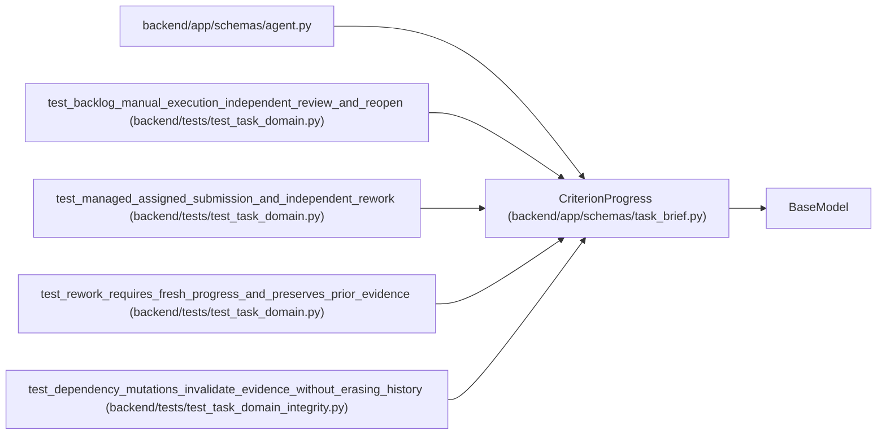

# CriterionProgress

**Location:** `backend/app/schemas/task_brief.py:56`
**Kind:** Pydantic model
**Bases:** `BaseModel`
**Module:** [schemas_task_brief](../modules/schemas_task_brief.md)

## Description

_Auto-generated from `CriterionProgress` in `backend/app/schemas/task_brief.py`._

## Model Configuration

| Setting | Value | Source |
|---------|-------|--------|
| `extra` | `'forbid'` | model_config |

## Attributes

| Name | Type | Wire name | Required | Nullable | Default | Constraints | Examples | Description |
|------|------|-----------|----------|----------|---------|-------------|-------------|----------|
| `criterion_id` | `str` | `criterion_id` | Yes | No | — | min_length=1; max_length=64 | — | — |
| `criterion_revision` | `int` | `criterion_revision` | Yes | No | — | ge=1 | — | — |
| `state` | `Literal['pending', 'in_progress', 'completed']` | `state` | No | No | `'pending'` | — | — | — |
| `evidence` | `str` | `evidence` | No | No | `''` | max_length=8000 | — | — |

## Methods

*No public methods. Inherits from base classes.*

## Relationships

<!-- Auto-generated relationship summary. Do not edit by hand. -->

### Summary

| Module | Methods | Attributes |
|---|---:|---|
| [schemas_task_brief](../modules/schemas_task_brief.md) | 0 | `criterion_id`, `criterion_revision`, `evidence`, `state` |

### Structure

| Kind | Entity | Module |
|---|---|---|
| Base | `BaseModel` | — |

### References

| Reference | Kind | Source | Call sites |
|---|---|---|---:|
| `agent` | import | [schemas_agent](../modules/schemas_agent.md) | — |
| `test_backlog_manual_execution_independent_review_and_reopen` | call | [test_task_domain](../modules/test_task_domain.md) | 1 |
| `test_managed_assigned_submission_and_independent_rework` | call | [test_task_domain](../modules/test_task_domain.md) | 1 |
| `test_rework_requires_fresh_progress_and_preserves_prior_evidence` | call | [test_task_domain](../modules/test_task_domain.md) | 1 |
| `test_dependency_mutations_invalidate_evidence_without_erasing_history` | call | [test_task_domain_integrity](../modules/test_task_domain_integrity.md) | 1 |
