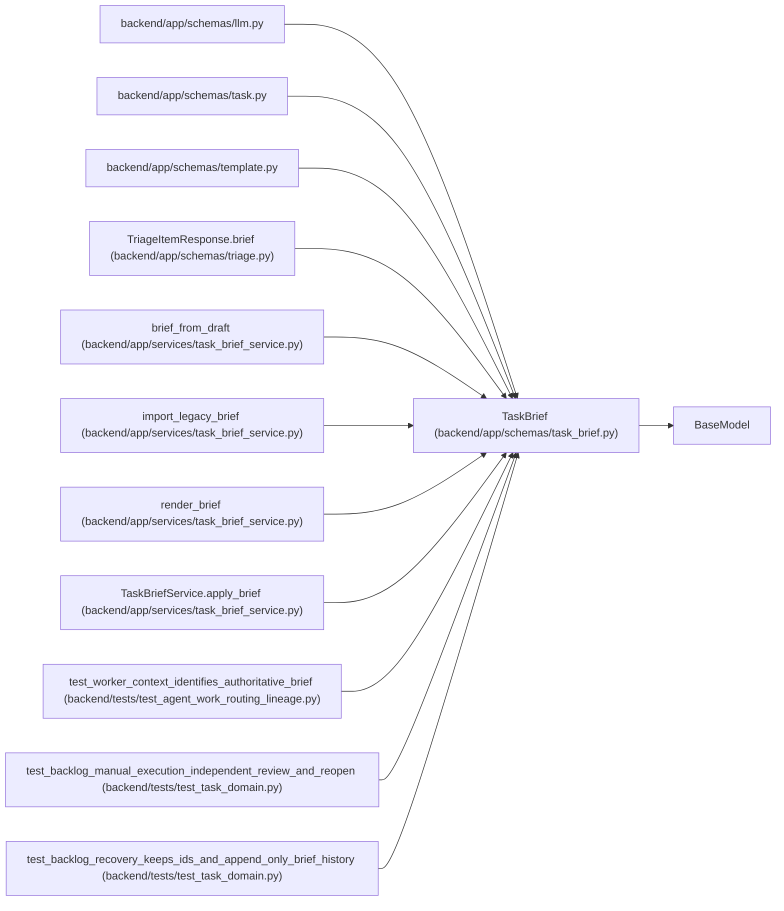

# TaskBrief

**Location:** `backend/app/schemas/task_brief.py:25`
**Kind:** Pydantic model
**Bases:** `BaseModel`
**Module:** [schemas_task_brief](../modules/schemas_task_brief.md)

## Description

_Auto-generated from `TaskBrief` in `backend/app/schemas/task_brief.py`._

## Model Configuration

| Setting | Value | Source |
|---------|-------|--------|
| `extra` | `'forbid'` | model_config |

## Validators

| Method | Scope | Fields | Mode | Options |
|--------|-------|--------|------|---------|
| `unique_criteria` | model | — | after | — |

## Attributes

| Name | Type | Wire name | Required | Nullable | Default | Constraints | Examples | Description |
|------|------|-----------|----------|----------|---------|-------------|-------------|----------|
| `schema_version` | `Literal[1]` | `schema_version` | No | No | `1` | — | — | — |
| `goal` | `str` | `goal` | No | No | `''` | max_length=8000 | — | — |
| `context` | `str` | `context` | No | No | `''` | max_length=20000 | — | — |
| `scope` | `str` | `scope` | No | No | `''` | max_length=12000 | — | — |
| `exclusions` | `str` | `exclusions` | No | No | `''` | max_length=12000 | — | — |
| `acceptance_criteria` | `list[BriefCriterion]` | `acceptance_criteria` | No | No | factory: `list` | max_length=100 | — | — |
| `verification` | `str` | `verification` | No | No | `''` | max_length=12000 | — | — |
| `artifact_expectations` | `str` | `artifact_expectations` | No | No | `''` | max_length=12000 | — | — |

## Methods

| Method | Signature | Decorators | Description |
|--------|-----------|------------|-------------|
| `unique_criteria` | `()` | `@model_validator(mode='after')` | — |

## Relationships

<!-- Auto-generated relationship summary. Do not edit by hand. -->

### Summary

| Module | Methods | Attributes |
|---|---:|---|
| [schemas_task_brief](../modules/schemas_task_brief.md) | 1 | `acceptance_criteria`, `artifact_expectations`, `context`, `exclusions`, `goal`, `schema_version`, `scope`, `verification` |

### Structure

| Kind | Entity | Module |
|---|---|---|
| Base | `BaseModel` | — |

### References

| Reference | Kind | Source | Call sites |
|---|---|---|---:|
| `llm` | import | [schemas_llm](../modules/schemas_llm.md) | — |
| `task` | import | [schemas_task](../modules/schemas_task.md) | — |
| `template` | import | [schemas_template](../modules/schemas_template.md) | — |
| `TriageItemResponse.brief` | type_reference | [schemas_triage](../modules/schemas_triage.md) | — |
| `brief_from_draft` | call | [task_brief_service](../modules/task_brief_service.md) | 1 |
| `brief_from_draft` | type_reference | [task_brief_service](../modules/task_brief_service.md) | — |
| `import_legacy_brief` | type_reference | [task_brief_service](../modules/task_brief_service.md) | — |
| `render_brief` | type_reference | [task_brief_service](../modules/task_brief_service.md) | — |
| `TaskBriefService.apply_brief` | type_reference | [task_brief_service](../modules/task_brief_service.md) | — |
| `test_worker_context_identifies_authoritative_brief` | call | [test_agent_work_routing_lineage](../modules/test_agent_work_routing_lineage.md) | 1 |
| `test_backlog_manual_execution_independent_review_and_reopen` | call | [test_task_domain](../modules/test_task_domain.md) | 1 |
| `test_backlog_recovery_keeps_ids_and_append_only_brief_history` | call | [test_task_domain](../modules/test_task_domain.md) | 1 |

> References: showing 12 of 19 logical references; 7 omitted by the 12-row generated summary limit.
