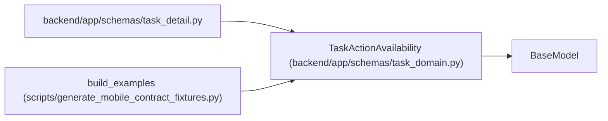

# TaskActionAvailability

**Location:** `backend/app/schemas/task_domain.py:35`
**Kind:** Pydantic model
**Bases:** `BaseModel`
**Module:** [schemas_task_domain](../modules/schemas_task_domain.md)

## Description

_Auto-generated from `TaskActionAvailability` in `backend/app/schemas/task_domain.py`._

## Attributes

| Name | Type | Wire name | Required | Nullable | Default | Constraints | Examples | Description |
|------|------|-----------|----------|----------|---------|-------------|-------------|----------|
| `action` | `str` | `action` | Yes | No | — | — | — | — |
| `allowed` | `bool` | `allowed` | Yes | No | — | — | — | — |
| `blockers` | `list[TaskActionBlocker]` | `blockers` | No | No | factory: `list` | — | — | — |

## Methods

*No public methods. Inherits from base classes.*

## Relationships

<!-- Auto-generated relationship summary. Do not edit by hand. -->

### Summary

| Module | Methods | Attributes |
|---|---:|---|
| [schemas_task_domain](../modules/schemas_task_domain.md) | 0 | `action`, `allowed`, `blockers` |

### Structure

| Kind | Entity | Module |
|---|---|---|
| Base | `BaseModel` | — |

### References

| Reference | Kind | Source | Call sites |
|---|---|---|---:|
| `task_detail` | import | [task_detail](../modules/task_detail.md) | — |
| `build_examples` | call | [generate_mobile_contract_fixtures](../modules/generate_mobile_contract_fixtures.md) | 2 |
