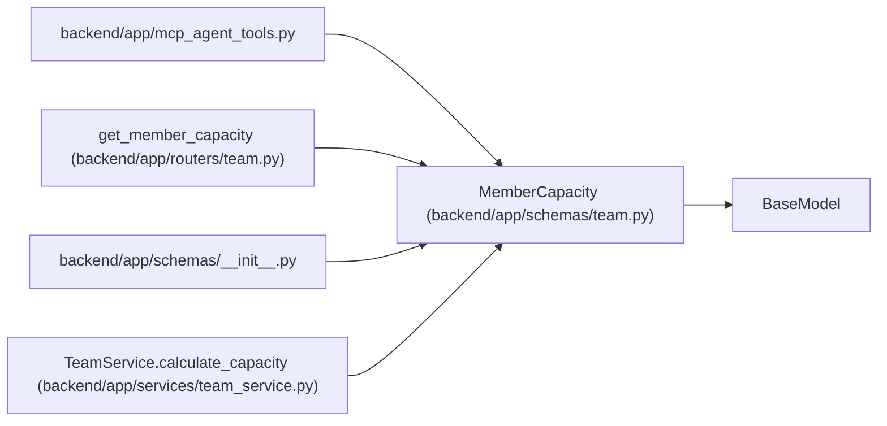

# MemberCapacity

**Location:** `backend/app/schemas/team.py:308`
**Kind:** Pydantic model
**Bases:** `BaseModel`
**Module:** [schemas_team](../modules/schemas_team.md)

## Description

Capacity calculation for a team member.

## Attributes

| Name | Type | Wire name | Required | Nullable | Default | Constraints | Examples | Description |
|------|------|-----------|----------|----------|---------|-------------|-------------|----------|
| `team_member_id` | `int` | `team_member_id` | Yes | No | — | — | — | — |
| `working_days` | `int` | `working_days` | Yes | No | — | — | — | — |
| `vacation_days` | `int` | `vacation_days` | Yes | No | — | — | — | — |
| `available_days` | `float` | `available_days` | Yes | No | — | — | — | — |
| `effective_days` | `float` | `effective_days` | Yes | No | — | — | — | — |
| `adjusted_days` | `float` | `adjusted_days` | Yes | No | — | — | — | — |
| `hours` | `float` | `hours` | Yes | No | — | — | — | — |

## Methods

*No public methods. Inherits from base classes.*

## Relationships

<!-- Auto-generated relationship summary. Do not edit by hand. -->

### Summary

| Module | Methods | Attributes |
|---|---:|---|
| [schemas_team](../modules/schemas_team.md) | 0 | `adjusted_days`, `available_days`, `effective_days`, `hours`, `team_member_id`, `vacation_days`, `working_days` |

### Structure

| Kind | Entity | Module |
|---|---|---|
| Base | `BaseModel` | — |

### References

| Reference | Kind | Source | Call sites |
|---|---|---|---:|
| `mcp_agent_tools` | import | [mcp_agent_tools](../modules/mcp_agent_tools.md) | — |
| `get_member_capacity` | type_reference | [routers_team](../modules/routers_team.md) | — |
| `__init__` | import | [schemas___init__](../modules/schemas___init__.md) | — |
| `TeamService.calculate_capacity` | call | [team_service](../modules/team_service.md) | 1 |
| `TeamService.calculate_capacity` | type_reference | [team_service](../modules/team_service.md) | — |
