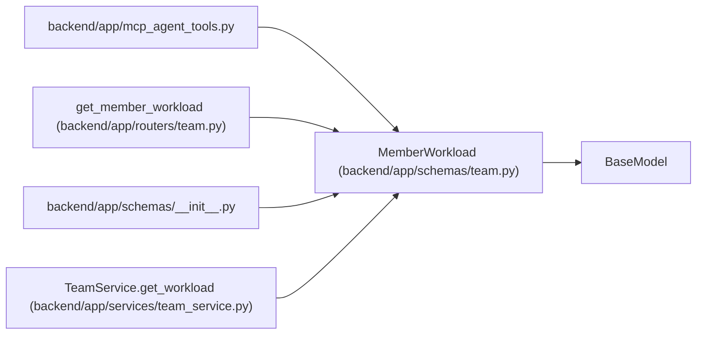

# MemberWorkload

**Location:** `backend/app/schemas/team.py:330`
**Kind:** Pydantic model
**Bases:** `BaseModel`
**Module:** [schemas_team](../modules/schemas_team.md)

## Description

Workload information for a team member.

## Attributes

| Name | Type | Wire name | Required | Nullable | Default | Constraints | Examples | Description |
|------|------|-----------|----------|----------|---------|-------------|-------------|----------|
| `team_member_id` | `int` | `team_member_id` | Yes | No | — | — | — | — |
| `name` | `str` | `name` | Yes | No | — | — | — | — |
| `capacity_days` | `float` | `capacity_days` | Yes | No | — | — | — | — |
| `allocated_days` | `float` | `allocated_days` | Yes | No | — | — | — | — |
| `free_days` | `float` | `free_days` | Yes | No | — | — | — | — |
| `workload_status` | `Literal['green', 'yellow', 'red']` | `workload_status` | Yes | No | — | — | — | — |
| `workload_percent` | `float` | `workload_percent` | Yes | No | — | — | — | — |

## Methods

*No public methods. Inherits from base classes.*

## Relationships

<!-- Auto-generated relationship summary. Do not edit by hand. -->

### Summary

| Module | Methods | Attributes |
|---|---:|---|
| [schemas_team](../modules/schemas_team.md) | 0 | `allocated_days`, `capacity_days`, `free_days`, `name`, `team_member_id`, `workload_percent`, `workload_status` |

### Structure

| Kind | Entity | Module |
|---|---|---|
| Base | `BaseModel` | — |

### References

| Reference | Kind | Source | Call sites |
|---|---|---|---:|
| `mcp_agent_tools` | import | [mcp_agent_tools](../modules/mcp_agent_tools.md) | — |
| `get_member_workload` | type_reference | [routers_team](../modules/routers_team.md) | — |
| `__init__` | import | [schemas___init__](../modules/schemas___init__.md) | — |
| `TeamService.get_workload` | call | [team_service](../modules/team_service.md) | 1 |
| `TeamService.get_workload` | type_reference | [team_service](../modules/team_service.md) | — |
