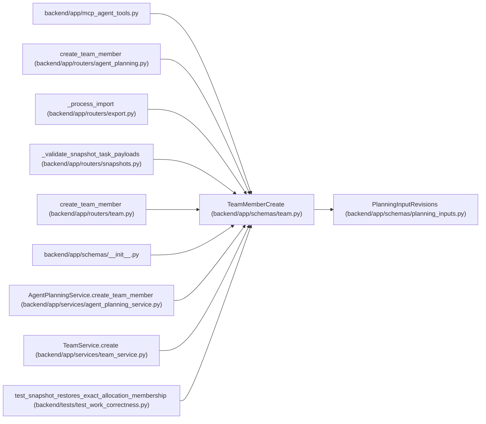

# TeamMemberCreate

**Location:** `backend/app/schemas/team.py:85`
**Kind:** Pydantic model
**Bases:** `PlanningInputRevisions`
**Module:** [schemas_team](../modules/schemas_team.md)

## Description

Schema for creating a team member.

## Attributes

| Name | Type | Wire name | Required | Nullable | Default | Constraints | Examples | Description |
|------|------|-----------|----------|----------|---------|-------------|-------------|----------|
| `name` | `str` | `name` | Yes | No | — | min_length=1; max_length=255 | — | — |
| `position` | `str` | `position` | Yes | No | — | min_length=1; max_length=255 | — | — |
| `email` | `Optional[str]` | `email` | No | Yes | `None` | max_length=255 | — | — |
| `profile_id` | `Optional[int]` | `profile_id` | No | Yes | `None` | — | — | — |
| `availability_percent` | `float` | `availability_percent` | No | No | `100.0` | ge=0; le=100 | — | — |
| `professionalism_coefficient` | `float` | `professionalism_coefficient` | No | No | `1.0` | ge=0.5; le=5.0 | — | — |
| `operational_utilization` | `float` | `operational_utilization` | No | No | `20.0` | ge=0; le=100 | — | — |

## Methods

*No public methods. Inherits from base classes.*

## Relationships

<!-- Auto-generated relationship summary. Do not edit by hand. -->

### Summary

| Module | Methods | Attributes |
|---|---:|---|
| [schemas_team](../modules/schemas_team.md) | 0 | `availability_percent`, `email`, `name`, `operational_utilization`, `position`, `professionalism_coefficient`, `profile_id` |

### Structure

| Kind | Entity | Module |
|---|---|---|
| Base | `PlanningInputRevisions` | [planning_inputs](../modules/planning_inputs.md) |

### References

| Reference | Kind | Source | Call sites |
|---|---|---|---:|
| `mcp_agent_tools` | import | [mcp_agent_tools](../modules/mcp_agent_tools.md) | — |
| `create_team_member` | type_reference | [routers_agent_planning](../modules/routers_agent_planning.md) | — |
| `_process_import` | call | [export](../modules/export.md) | 1 |
| `_validate_snapshot_task_payloads` | call | [snapshots](../modules/snapshots.md) | 1 |
| `create_team_member` | type_reference | [routers_team](../modules/routers_team.md) | — |
| `__init__` | import | [schemas___init__](../modules/schemas___init__.md) | — |
| `AgentPlanningService.create_team_member` | type_reference | [agent_planning_service](../modules/agent_planning_service.md) | — |
| `TeamService.create` | type_reference | [team_service](../modules/team_service.md) | — |
| `test_snapshot_restores_exact_allocation_membership` | call | [test_work_correctness](../modules/test_work_correctness.md) | 1 |
