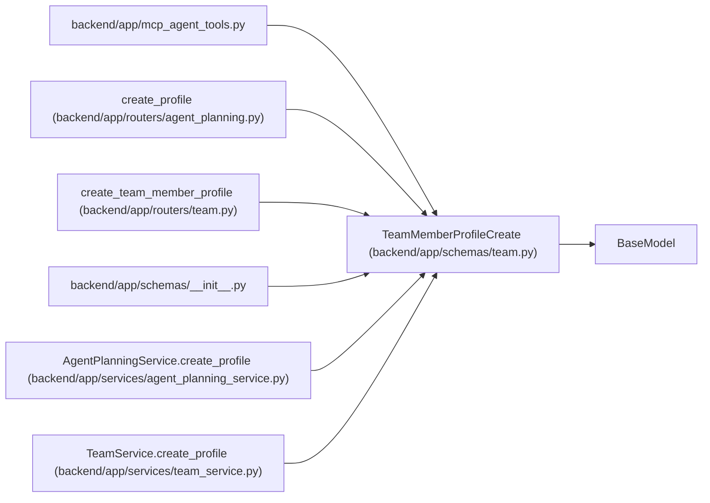

# TeamMemberProfileCreate

**Location:** `backend/app/schemas/team.py:195`
**Kind:** Pydantic model
**Bases:** `BaseModel`
**Module:** [schemas_team](../modules/schemas_team.md)

## Description

Schema for creating a reusable team-member profile.

## Validators

| Method | Scope | Fields | Mode | Options |
|--------|-------|--------|------|---------|
| `trim_display_name` | field | display_name | after | — |
| `trim_optional_text` | field | seed_key, email, headline, summary, notes | after | — |

## Attributes

| Name | Type | Wire name | Required | Nullable | Default | Constraints | Examples | Description |
|------|------|-----------|----------|----------|---------|-------------|-------------|----------|
| `seed_key` | `Optional[str]` | `seed_key` | No | Yes | `None` | max_length=120 | — | — |
| `display_name` | `str` | `display_name` | Yes | No | — | min_length=1; max_length=255 | — | — |
| `email` | `Optional[str]` | `email` | No | Yes | `None` | max_length=255 | — | — |
| `headline` | `Optional[str]` | `headline` | No | Yes | `None` | max_length=255 | — | — |
| `summary` | `Optional[str]` | `summary` | No | Yes | `None` | — | — | — |
| `notes` | `Optional[str]` | `notes` | No | Yes | `None` | — | — | — |
| `automation_enabled` | `bool` | `automation_enabled` | No | No | `True` | — | — | — |
| `profile_kind` | `Literal['human', 'agent', 'hybrid']` | `profile_kind` | No | No | `'human'` | — | — | — |
| `assignment_modes` | `list[Literal['ownership', 'execution', 'verification', 'design_handoff']]` | `assignment_modes` | No | No | factory: `list` | — | — | — |

## Methods

| Method | Signature | Decorators | Description |
|--------|-----------|------------|-------------|
| `trim_display_name` | `(value: str) -> str` | `@field_validator('display_name', mode='after')`, `@classmethod` | — |
| `trim_optional_text` | `(value: Optional[str]) -> Optional[str]` | `@field_validator('seed_key', 'email', 'headline', 'summary', 'notes', mode='after')`, `@classmethod` | — |

## Relationships

<!-- Auto-generated relationship summary. Do not edit by hand. -->

### Summary

| Module | Methods | Attributes |
|---|---:|---|
| [schemas_team](../modules/schemas_team.md) | 2 | `assignment_modes`, `automation_enabled`, `display_name`, `email`, `headline`, `notes`, `profile_kind`, `seed_key`, `summary` |

### Structure

| Kind | Entity | Module |
|---|---|---|
| Base | `BaseModel` | — |

### References

| Reference | Kind | Source | Call sites |
|---|---|---|---:|
| `mcp_agent_tools` | import | [mcp_agent_tools](../modules/mcp_agent_tools.md) | — |
| `create_profile` | type_reference | [routers_agent_planning](../modules/routers_agent_planning.md) | — |
| `create_team_member_profile` | type_reference | [routers_team](../modules/routers_team.md) | — |
| `__init__` | import | [schemas___init__](../modules/schemas___init__.md) | — |
| `AgentPlanningService.create_profile` | type_reference | [agent_planning_service](../modules/agent_planning_service.md) | — |
| `TeamService.create_profile` | type_reference | [team_service](../modules/team_service.md) | — |
