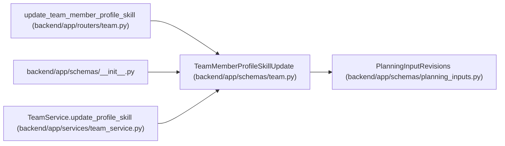

# TeamMemberProfileSkillUpdate

**Location:** `backend/app/schemas/team.py:141`
**Kind:** Pydantic model
**Bases:** `PlanningInputRevisions`
**Module:** [schemas_team](../modules/schemas_team.md)

## Description

Schema for updating a profile skill or weakness.

## Validators

| Method | Scope | Fields | Mode | Options |
|--------|-------|--------|------|---------|
| `trim_required_text` | field | skill_key, skill_name | after | — |
| `trim_optional_text` | field | category, notes | after | — |
| `validate_keywords` | field | keywords_json | before | — |

## Attributes

| Name | Type | Wire name | Required | Nullable | Default | Constraints | Examples | Description |
|------|------|-----------|----------|----------|---------|-------------|-------------|----------|
| `skill_key` | `Optional[str]` | `skill_key` | No | Yes | `None` | min_length=1; max_length=120 | — | — |
| `skill_name` | `Optional[str]` | `skill_name` | No | Yes | `None` | min_length=1; max_length=255 | — | — |
| `category` | `Optional[str]` | `category` | No | Yes | `None` | max_length=120 | — | — |
| `level` | `Optional[int]` | `level` | No | Yes | `None` | ge=1; le=5 | — | — |
| `interest` | `Optional[int]` | `interest` | No | Yes | `None` | ge=1; le=5 | — | — |
| `is_weakness` | `Optional[bool]` | `is_weakness` | No | Yes | `None` | — | — | — |
| `keywords_json` | `Optional[list[str]]` | `keywords_json` | No | Yes | `None` | — | — | — |
| `notes` | `Optional[str]` | `notes` | No | Yes | `None` | — | — | — |

## Methods

| Method | Signature | Decorators | Description |
|--------|-----------|------------|-------------|
| `trim_required_text` | `(value: Optional[str]) -> Optional[str]` | `@field_validator('skill_key', 'skill_name', mode='after')`, `@classmethod` | — |
| `trim_optional_text` | `(value: Optional[str]) -> Optional[str]` | `@field_validator('category', 'notes', mode='after')`, `@classmethod` | — |
| `validate_keywords` | `(value: Any) -> Optional[list[str]]` | `@field_validator('keywords_json', mode='before')`, `@classmethod` | — |

## Relationships

<!-- Auto-generated relationship summary. Do not edit by hand. -->

### Summary

| Module | Methods | Attributes |
|---|---:|---|
| [schemas_team](../modules/schemas_team.md) | 3 | `category`, `interest`, `is_weakness`, `keywords_json`, `level`, `notes`, `skill_key`, `skill_name` |

### Structure

| Kind | Entity | Module |
|---|---|---|
| Base | `PlanningInputRevisions` | [planning_inputs](../modules/planning_inputs.md) |

### References

| Reference | Kind | Source | Call sites |
|---|---|---|---:|
| `update_team_member_profile_skill` | type_reference | [routers_team](../modules/routers_team.md) | — |
| `__init__` | import | [schemas___init__](../modules/schemas___init__.md) | — |
| `TeamService.update_profile_skill` | type_reference | [team_service](../modules/team_service.md) | — |
