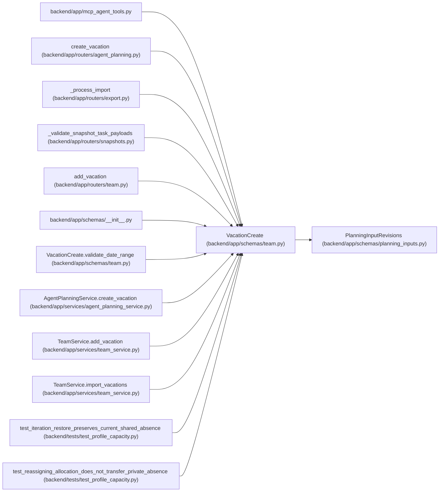

# VacationCreate

**Location:** `backend/app/schemas/team.py:28`
**Kind:** Pydantic model
**Bases:** `PlanningInputRevisions`
**Module:** [schemas_team](../modules/schemas_team.md)

## Description

Schema for creating a vacation.

## Validators

| Method | Scope | Fields | Mode | Options |
|--------|-------|--------|------|---------|
| `validate_date_range` | model | — | after | — |

## Attributes

| Name | Type | Wire name | Required | Nullable | Default | Constraints | Examples | Description |
|------|------|-----------|----------|----------|---------|-------------|-------------|----------|
| `start_date` | `date` | `start_date` | Yes | No | — | — | — | — |
| `end_date` | `date` | `end_date` | Yes | No | — | — | — | — |

## Methods

| Method | Signature | Decorators | Description |
|--------|-----------|------------|-------------|
| `validate_date_range` | `() -> 'VacationCreate'` | `@model_validator(mode='after')` | Reject an inverted vacation period. |

## Relationships

<!-- Auto-generated relationship summary. Do not edit by hand. -->

### Summary

| Module | Methods | Attributes |
|---|---:|---|
| [schemas_team](../modules/schemas_team.md) | 1 | `end_date`, `start_date` |

### Structure

| Kind | Entity | Module |
|---|---|---|
| Base | `PlanningInputRevisions` | [planning_inputs](../modules/planning_inputs.md) |

### References

| Reference | Kind | Source | Call sites |
|---|---|---|---:|
| `mcp_agent_tools` | import | [mcp_agent_tools](../modules/mcp_agent_tools.md) | — |
| `create_vacation` | type_reference | [routers_agent_planning](../modules/routers_agent_planning.md) | — |
| `_process_import` | call | [export](../modules/export.md) | 1 |
| `_validate_snapshot_task_payloads` | call | [snapshots](../modules/snapshots.md) | 1 |
| `add_vacation` | type_reference | [routers_team](../modules/routers_team.md) | — |
| `__init__` | import | [schemas___init__](../modules/schemas___init__.md) | — |
| `VacationCreate.validate_date_range` | type_reference | [schemas_team](../modules/schemas_team.md) | — |
| `AgentPlanningService.create_vacation` | type_reference | [agent_planning_service](../modules/agent_planning_service.md) | — |
| `TeamService.add_vacation` | type_reference | [team_service](../modules/team_service.md) | — |
| `TeamService.import_vacations` | call | [team_service](../modules/team_service.md) | 1 |
| `test_iteration_restore_preserves_current_shared_absence` | call | [test_profile_capacity](../modules/test_profile_capacity.md) | 1 |
| `test_reassigning_allocation_does_not_transfer_private_absence` | call | [test_profile_capacity](../modules/test_profile_capacity.md) | 1 |

> References: showing 12 of 13 logical references; 1 omitted by the 12-row generated summary limit.
