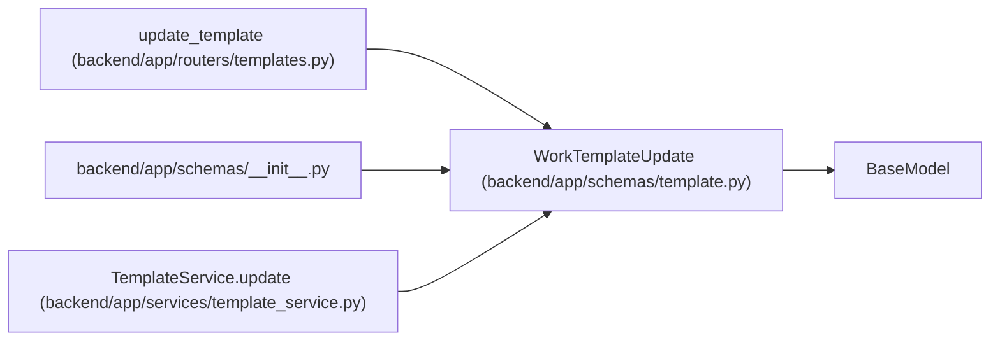

# WorkTemplateUpdate

**Location:** `backend/app/schemas/template.py:47`
**Kind:** Pydantic model
**Bases:** `BaseModel`
**Module:** [schemas_template](../modules/schemas_template.md)

## Description

Schema for updating a reusable work template.

## Model Configuration

| Setting | Value | Source |
|---------|-------|--------|
| `extra` | `'forbid'` | model_config |

## Validators

| Method | Scope | Fields | Mode | Options |
|--------|-------|--------|------|---------|
| `validate_brief_payload` | field | default_payload | after | — |

## Attributes

| Name | Type | Wire name | Required | Nullable | Default | Constraints | Examples | Description |
|------|------|-----------|----------|----------|---------|-------------|-------------|----------|
| `name` | `Optional[str]` | `name` | No | Yes | `None` | max_length=255; min_length=1 | — | — |
| `description` | `Optional[str]` | `description` | No | Yes | `None` | — | — | — |
| `template_type` | `Optional[TemplateType]` | `template_type` | No | Yes | `None` | — | — | — |
| `default_title` | `Optional[str]` | `default_title` | No | Yes | `None` | max_length=500; min_length=1 | — | — |
| `default_description` | `Optional[str]` | `default_description` | No | Yes | `None` | — | — | — |
| `default_priority` | `Optional[int]` | `default_priority` | No | Yes | `None` | ge=1; le=10 | — | — |
| `default_effort_days` | `Optional[float]` | `default_effort_days` | No | Yes | `None` | ge=0.1 | — | — |
| `default_labels` | `Optional[list[str]]` | `default_labels` | No | Yes | `None` | — | — | — |
| `default_checklist` | `Optional[list[str]]` | `default_checklist` | No | Yes | `None` | — | — | — |
| `default_payload` | `Optional[dict[str, Any]]` | `default_payload` | No | Yes | `None` | — | — | — |
| `is_active` | `Optional[bool]` | `is_active` | No | Yes | `None` | — | — | — |
| `sort_order` | `Optional[int]` | `sort_order` | No | Yes | `None` | — | — | — |

## Methods

| Method | Signature | Decorators | Description |
|--------|-----------|------------|-------------|
| `validate_brief_payload` | `(value)` | `@field_validator('default_payload')`, `@classmethod` | — |

## Relationships

<!-- Auto-generated relationship summary. Do not edit by hand. -->

### Summary

| Module | Methods | Attributes |
|---|---:|---|
| [schemas_template](../modules/schemas_template.md) | 1 | `default_checklist`, `default_description`, `default_effort_days`, `default_labels`, `default_payload`, `default_priority`, `default_title`, `description`, `is_active`, `name`, `sort_order`, `template_type` |

### Structure

| Kind | Entity | Module |
|---|---|---|
| Base | `BaseModel` | — |

### References

| Reference | Kind | Source | Call sites |
|---|---|---|---:|
| `update_template` | type_reference | [templates](../modules/templates.md) | — |
| `__init__` | import | [schemas___init__](../modules/schemas___init__.md) | — |
| `TemplateService.update` | type_reference | [template_service](../modules/template_service.md) | — |
