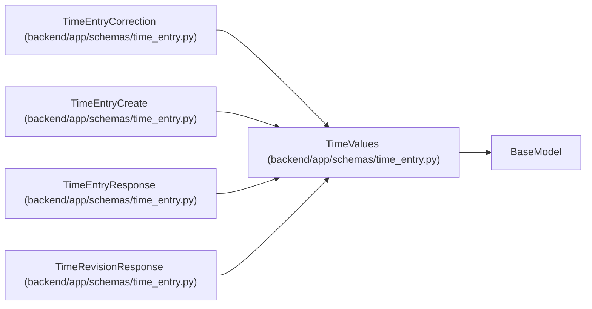

# TimeValues

**Location:** `backend/app/schemas/time_entry.py:12`
**Kind:** Pydantic model
**Bases:** `BaseModel`
**Module:** [schemas_time_entry](../modules/schemas_time_entry.md)

## Description

_Auto-generated from `TimeValues` in `backend/app/schemas/time_entry.py`._

## Model Configuration

| Setting | Value | Source |
|---------|-------|--------|
| `extra` | `'forbid'` | model_config |

## Validators

| Method | Scope | Fields | Mode | Options |
|--------|-------|--------|------|---------|
| `local_date_only` | field | work_date | before | — |
| `valid_timezone` | field | timezone | after | — |

## Attributes

| Name | Type | Wire name | Required | Nullable | Default | Constraints | Examples | Description |
|------|------|-----------|----------|----------|---------|-------------|-------------|----------|
| `work_date` | `date` | `work_date` | Yes | No | — | — | — | — |
| `timezone` | `str` | `timezone` | Yes | No | — | max_length=64; min_length=1 | — | — |
| `minutes` | `StrictInt` | `minutes` | Yes | No | — | ge=1; le=1440 | — | — |
| `note` | `str` | `note` | No | No | `''` | max_length=2000 | — | — |

## Methods

| Method | Signature | Decorators | Description |
|--------|-----------|------------|-------------|
| `local_date_only` | `(value)` | `@field_validator('work_date', mode='before')`, `@classmethod` | — |
| `valid_timezone` | `(value)` | `@field_validator('timezone')`, `@classmethod` | — |

## Relationships

<!-- Auto-generated relationship summary. Do not edit by hand. -->

### Summary

| Module | Methods | Attributes |
|---|---:|---|
| [schemas_time_entry](../modules/schemas_time_entry.md) | 2 | `minutes`, `note`, `timezone`, `work_date` |

### Structure

| Kind | Entity | Module |
|---|---|---|
| Base | `BaseModel` | — |
| Subclass | `TimeEntryCorrection` | [schemas_time_entry](../modules/schemas_time_entry.md) |
| Subclass | `TimeEntryCreate` | [schemas_time_entry](../modules/schemas_time_entry.md) |
| Subclass | `TimeEntryResponse` | [schemas_time_entry](../modules/schemas_time_entry.md) |
| Subclass | `TimeRevisionResponse` | [schemas_time_entry](../modules/schemas_time_entry.md) |
