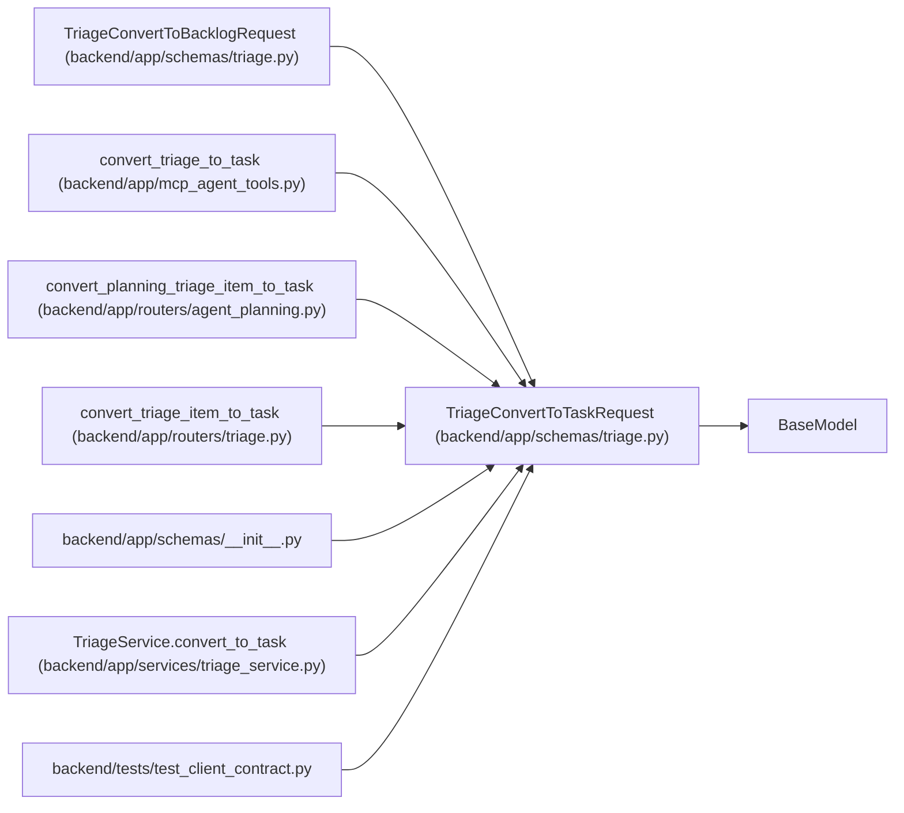

# TriageConvertToTaskRequest

**Location:** `backend/app/schemas/triage.py:269`
**Kind:** Pydantic model
**Bases:** `BaseModel`
**Module:** [schemas_triage](../modules/schemas_triage.md)

## Description

_Auto-generated from `TriageConvertToTaskRequest` in `backend/app/schemas/triage.py`._

## Attributes

| Name | Type | Wire name | Required | Nullable | Default | Constraints | Examples | Description |
|------|------|-----------|----------|----------|---------|-------------|-------------|----------|
| `brief` | `Optional[TaskBrief]` | `brief` | No | Yes | `None` | — | — | — |
| `owner_profile_id` | `Optional[int]` | `owner_profile_id` | No | Yes | `None` | ge=1 | — | — |
| `iteration_id` | `int` | `iteration_id` | Yes | No | — | — | — | — |
| `title` | `Optional[str]` | `title` | No | Yes | `None` | max_length=500; min_length=1 | — | — |
| `description` | `Optional[str]` | `description` | No | Yes | `None` | — | — | — |
| `project_id` | `Optional[int]` | `project_id` | No | Yes | `None` | — | — | — |
| `assignee_id` | `Optional[int]` | `assignee_id` | No | Yes | `None` | — | — | — |
| `priority` | `Optional[int]` | `priority` | No | Yes | `None` | ge=1; le=10 | — | — |
| `tags` | `Optional[list[str]]` | `tags` | No | Yes | `None` | — | — | — |
| `effort_days` | `Optional[float]` | `effort_days` | No | Yes | `None` | allow_inf_nan=False; ge=0 | — | — |
| `effort_hours` | `Optional[float]` | `effort_hours` | No | Yes | `None` | — | — | — |
| `depends_on` | `list[int]` | `depends_on` | No | No | factory: `list` | — | — | Task IDs |
| `scope` | `list[str]` | `scope` | No | No | factory: `list` | — | — | — |
| `out_of_scope` | `list[str]` | `out_of_scope` | No | No | factory: `list` | — | — | — |
| `suggested_checklist` | `list[str]` | `suggested_checklist` | No | No | factory: `list` | — | — | — |
| `acceptance_criteria` | `list[str]` | `acceptance_criteria` | No | No | factory: `list` | — | — | — |
| `verification` | `list[str]` | `verification` | No | No | factory: `list` | — | — | — |
| `expected_artifacts` | `list[str]` | `expected_artifacts` | No | No | factory: `list` | — | — | — |
| `risks` | `list[str]` | `risks` | No | No | factory: `list` | — | — | — |
| `implementation_notes` | `list[str]` | `implementation_notes` | No | No | factory: `list` | — | — | — |
| `open_questions` | `list[str]` | `open_questions` | No | No | factory: `list` | — | — | — |

## Methods

*No public methods. Inherits from base classes.*

## Relationships

<!-- Auto-generated relationship summary. Do not edit by hand. -->

### Summary

| Module | Methods | Attributes |
|---|---:|---|
| [schemas_triage](../modules/schemas_triage.md) | 0 | `acceptance_criteria`, `assignee_id`, `brief`, `depends_on`, `description`, `effort_days`, `effort_hours`, `expected_artifacts`, `implementation_notes`, `iteration_id`, `open_questions`, `out_of_scope` |

### Structure

| Kind | Entity | Module |
|---|---|---|
| Base | `BaseModel` | — |
| Subclass | `TriageConvertToBacklogRequest` | [schemas_triage](../modules/schemas_triage.md) |

### References

| Reference | Kind | Source | Call sites |
|---|---|---|---:|
| `convert_triage_to_task` | call | [mcp_agent_tools](../modules/mcp_agent_tools.md) | 1 |
| `convert_planning_triage_item_to_task` | type_reference | [routers_agent_planning](../modules/routers_agent_planning.md) | — |
| `convert_triage_item_to_task` | type_reference | [routers_triage](../modules/routers_triage.md) | — |
| `__init__` | import | [schemas___init__](../modules/schemas___init__.md) | — |
| `TriageService.convert_to_task` | type_reference | [triage_service](../modules/triage_service.md) | — |
| `test_client_contract` | import | [test_client_contract](../modules/test_client_contract.md) | — |
