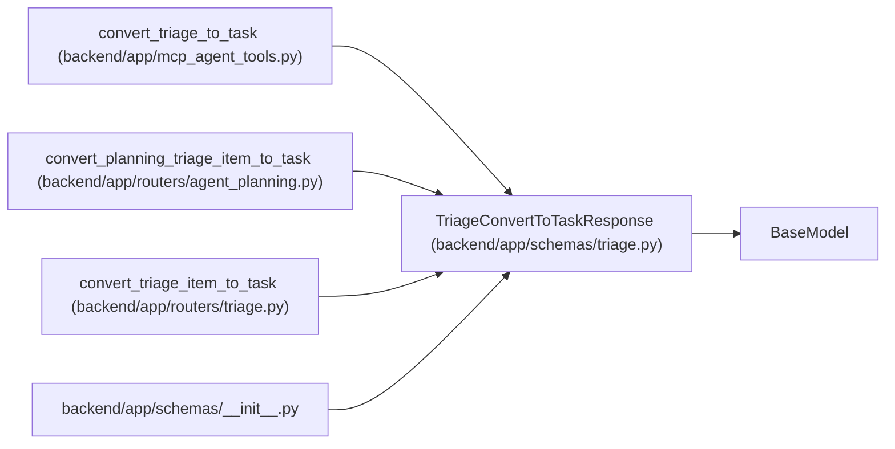

# TriageConvertToTaskResponse

**Location:** `backend/app/schemas/triage.py:260`
**Kind:** Pydantic model
**Bases:** `BaseModel`
**Module:** [schemas_triage](../modules/schemas_triage.md)

## Description

Response for triage item conversion.

## Attributes

| Name | Type | Wire name | Required | Nullable | Default | Constraints | Examples | Description |
|------|------|-----------|----------|----------|---------|-------------|-------------|----------|
| `triage_item` | `TriageItemResponse` | `triage_item` | Yes | No | — | — | — | — |
| `task` | `TaskResponse` | `task` | Yes | No | — | — | — | — |

## Methods

*No public methods. Inherits from base classes.*

## Relationships

<!-- Auto-generated relationship summary. Do not edit by hand. -->

### Summary

| Module | Methods | Attributes |
|---|---:|---|
| [schemas_triage](../modules/schemas_triage.md) | 0 | `task`, `triage_item` |

### Structure

| Kind | Entity | Module |
|---|---|---|
| Base | `BaseModel` | — |

### References

| Reference | Kind | Source | Call sites |
|---|---|---|---:|
| `convert_triage_to_task` | call | [mcp_agent_tools](../modules/mcp_agent_tools.md) | 1 |
| `convert_planning_triage_item_to_task` | type_reference | [routers_agent_planning](../modules/routers_agent_planning.md) | — |
| `convert_triage_item_to_task` | call | [routers_triage](../modules/routers_triage.md) | 1 |
| `convert_triage_item_to_task` | type_reference | [routers_triage](../modules/routers_triage.md) | — |
| `__init__` | import | [schemas___init__](../modules/schemas___init__.md) | — |
