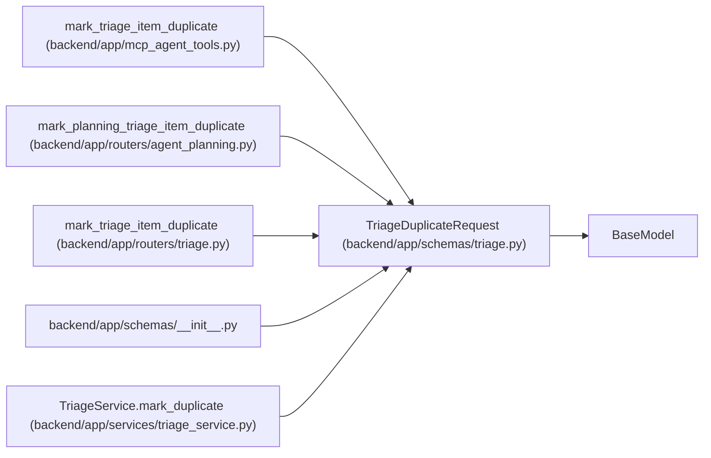

# TriageDuplicateRequest

**Location:** `backend/app/schemas/triage.py:148`
**Kind:** Pydantic model
**Bases:** `BaseModel`
**Module:** [schemas_triage](../modules/schemas_triage.md)

## Description

Request for marking a triage item as duplicate.

## Validators

| Method | Scope | Fields | Mode | Options |
|--------|-------|--------|------|---------|
| `validate_duplicate_target` | model | — | after | — |

## Attributes

| Name | Type | Wire name | Required | Nullable | Default | Constraints | Examples | Description |
|------|------|-----------|----------|----------|---------|-------------|-------------|----------|
| `duplicate_of_id` | `Optional[int]` | `duplicate_of_id` | No | Yes | `None` | — | — | — |
| `duplicate_task_id` | `Optional[int]` | `duplicate_task_id` | No | Yes | `None` | — | — | — |
| `link_request_to_duplicate_task` | `bool` | `link_request_to_duplicate_task` | No | No | `False` | — | — | — |
| `reason` | `Optional[str]` | `reason` | No | Yes | `None` | max_length=500 | — | — |

## Methods

| Method | Signature | Decorators | Description |
|--------|-----------|------------|-------------|
| `validate_duplicate_target` | `()` | `@model_validator(mode='after')` | Require exactly one duplicate target. |

## Relationships

<!-- Auto-generated relationship summary. Do not edit by hand. -->

### Summary

| Module | Methods | Attributes |
|---|---:|---|
| [schemas_triage](../modules/schemas_triage.md) | 1 | `duplicate_of_id`, `duplicate_task_id`, `link_request_to_duplicate_task`, `reason` |

### Structure

| Kind | Entity | Module |
|---|---|---|
| Base | `BaseModel` | — |

### References

| Reference | Kind | Source | Call sites |
|---|---|---|---:|
| `mark_triage_item_duplicate` | call | [mcp_agent_tools](../modules/mcp_agent_tools.md) | 1 |
| `mark_planning_triage_item_duplicate` | type_reference | [routers_agent_planning](../modules/routers_agent_planning.md) | — |
| `mark_triage_item_duplicate` | type_reference | [routers_triage](../modules/routers_triage.md) | — |
| `__init__` | import | [schemas___init__](../modules/schemas___init__.md) | — |
| `TriageService.mark_duplicate` | type_reference | [triage_service](../modules/triage_service.md) | — |
