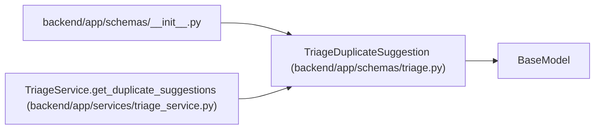

# TriageDuplicateSuggestion

**Location:** `backend/app/schemas/triage.py:165`
**Kind:** Pydantic model
**Bases:** `BaseModel`
**Module:** [schemas_triage](../modules/schemas_triage.md)

## Description

Candidate duplicate returned by advisory duplicate search.

## Attributes

| Name | Type | Wire name | Required | Nullable | Default | Constraints | Examples | Description |
|------|------|-----------|----------|----------|---------|-------------|-------------|----------|
| `target_type` | `Literal['triage_item', 'task']` | `target_type` | Yes | No | — | — | — | — |
| `target_id` | `int` | `target_id` | Yes | No | — | — | — | — |
| `title` | `str` | `title` | Yes | No | — | — | — | — |
| `description` | `Optional[str]` | `description` | No | Yes | `None` | — | — | — |
| `status` | `Optional[str]` | `status` | No | Yes | `None` | — | — | — |
| `source` | `Optional[str]` | `source` | No | Yes | `None` | — | — | — |
| `source_url` | `Optional[str]` | `source_url` | No | Yes | `None` | — | — | — |
| `external_key` | `Optional[str]` | `external_key` | No | Yes | `None` | — | — | — |
| `labels` | `list[str]` | `labels` | No | No | factory: `list` | — | — | — |
| `project_id` | `Optional[int]` | `project_id` | No | Yes | `None` | — | — | — |
| `iteration_id` | `Optional[int]` | `iteration_id` | No | Yes | `None` | — | — | — |
| `score` | `float` | `score` | Yes | No | — | — | — | — |
| `signals` | `list[str]` | `signals` | No | No | factory: `list` | — | — | — |

## Methods

*No public methods. Inherits from base classes.*

## Relationships

<!-- Auto-generated relationship summary. Do not edit by hand. -->

### Summary

| Module | Methods | Attributes |
|---|---:|---|
| [schemas_triage](../modules/schemas_triage.md) | 0 | `description`, `external_key`, `iteration_id`, `labels`, `project_id`, `score`, `signals`, `source`, `source_url`, `status`, `target_id`, `target_type` |

### Structure

| Kind | Entity | Module |
|---|---|---|
| Base | `BaseModel` | — |

### References

| Reference | Kind | Source | Call sites |
|---|---|---|---:|
| `__init__` | import | [schemas___init__](../modules/schemas___init__.md) | — |
| `TriageService.get_duplicate_suggestions` | call | [triage_service](../modules/triage_service.md) | 2 |
| `TriageService.get_duplicate_suggestions` | type_reference | [triage_service](../modules/triage_service.md) | — |
